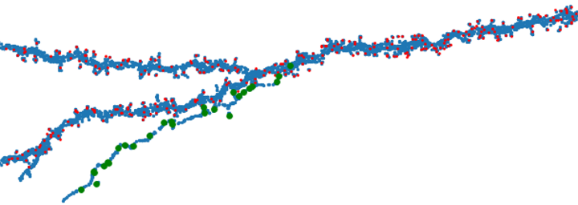

# layer23-volume
Reconstructions and analyses of mouse cortex Layer 2/3 serial EM volume

**Attribution:** https://www.microns-explorer.org/terms-and-conditions 
**Citation:** https://www.microns-explorer.org/citation-policy 

***

### Over a century ago, Golgi and Cajal revolutionized the field of neuroscience

For an intriguing summary of this revolution, read Mitch Glickstein's [**essay**](https://www.cell.com/current-biology/pdf/S0960-9822(06)01203-6.pdf) on Golgi and Cajal in <em>Cell</em>.

<em>Image credit: I created this serial LM reconstruction of a Golgi-stained mouse pyramidal neuron using a Zeiss Photomicroscope II at 40x oil and Smart Objects in Photoshop.</em>

### Once again neuroscience is undergoing another revolution with the serial electron microscope brain reconstructions

Petabytes of data have been generated for small volumes (1 cubic mm or less) of human, mouse, songbird, and fly brain volumes. This gargantuan task has been spearheaded by investigators from a variety of entities, including Allen Institute, Baylor, Columbia, Google Research, Harvard, IARPA, Janelia/HHMI, Johns Hopkins, Max Planck Institute, Princeton, Rice, and the University of Cambridge, among others.  

<em>Image credit, I created this reconstruction using Neuroglancer of pyramidal neuron with cellid 648518346349538440 in the Layer 2/3 volume.</em>  

***

## Contents
This github repo focuses on visualization and analyses of the Layer 2/3 EM volume data generated in the IARPA Microns consortium (Allen Institute, Baylor, Princeton). The volume can be viewed in Neuroglancer (developed at Google Research). Allen Institute and the Seung lab at Princeton have posted datasets, resources, analysis tools, and more on their respective github repos, and also at the Allen Brain Map website. 

### Look up and visualization tools

Use `lookup_cellid_in_layer23_volume.ipynb` to identify the cell subtype for a given cellid in the Layer 2/3 volume. This is a human-curated list for cells that contain all (or most) of the cell soma within the volume.

Use `lookup_mitochondria_ids.ipynb` to look up mitochondria ids by cellid. Useful for creating a list of mito ids for visualization in neuroglancer and for analyzing voxel data.

Use `lookup_synapse_ids.ipynb` to look up synapse ids by pre- and post-synaptic cell ids. Also contains voxel data.

Use `synapse_visualizer.ipynb` to create a 2D and 3D visualization of all pre- and post-synaptic sites on a cell of interest.

### Interesting features in the Layer 2/3 volume

#### Axon-carrying dendrite
[`axon_carrying_dendrite` folder](https://github.com/shandran/layer23-volume/tree/main/axon_carrying_dendrite): a partial neuron (soma is not in the volume) with a possible axon-carrying dendrite.

#### Mitocondria visualizations
[`mitochondria` folder](https://github.com/shandran/layer23-volume/tree/main/mitochondria): analysis of interesting mitochondrial features in the layer 2/3 volume, including the largest contiguous mitochondrion in an astrocyte, and the largest number of mitochondria by count in an inhibitory basket neuron.

#### Two neurons with the most synapses in the Layer 2/3 volume
[`most_synapses` folder](https://github.com/shandran/layer23-volume/tree/main/most_synapses): reconstructions and synaptic analyses of an excitatory pyramidal neuron with the most synapses in the volume, along with an inhibitory basket neuron making the most synapses onto other processes within the volume. 

#### An exceptional oligodendrocyte
[`oligodendrocyte_648518346349508279` folder](https://github.com/shandran/layer23-volume/tree/main/oligodendrocyte_648518346349508279): a beautiful example of an oligocyte in the layer 2/3 volume. Images of myelination as well as an example of mis-segmentation where a synaptic bouton from a nearby axon was incorrectly segmented to the oligodendrocyte cell.

***

##### Thank you for stopping by!

Drop me an email if you have any questions or would like to collaborate.
Shawn
