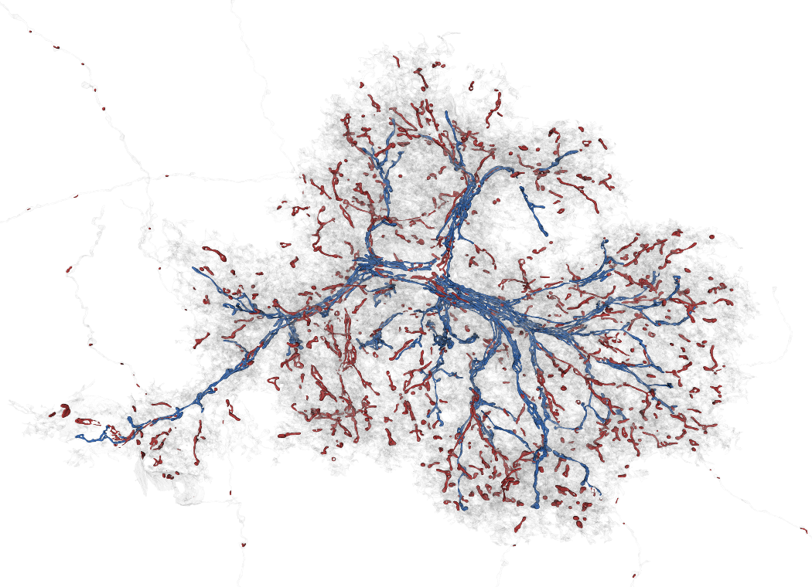
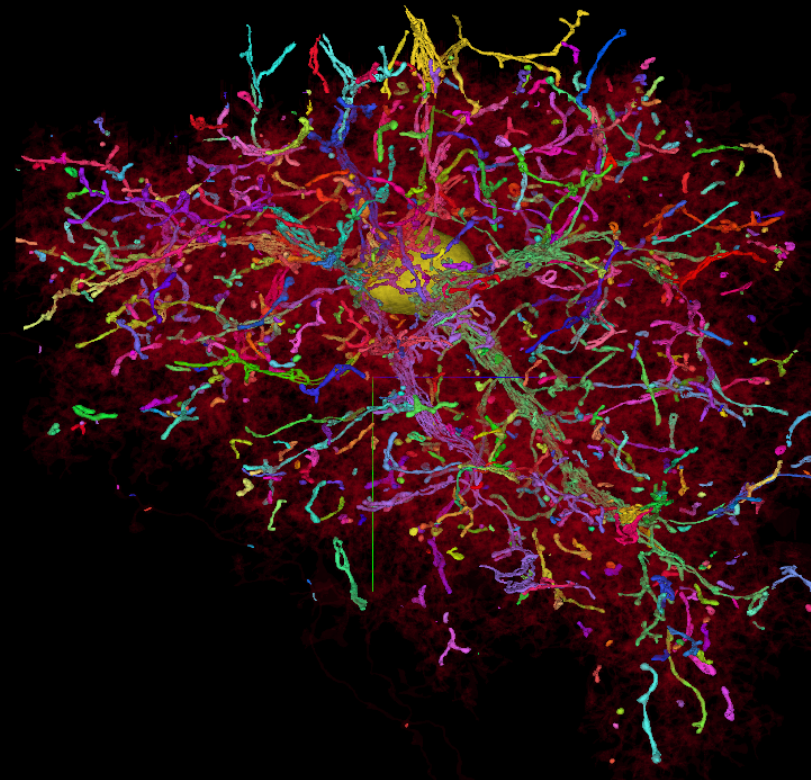
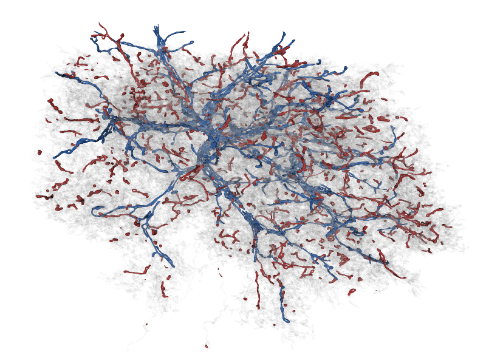
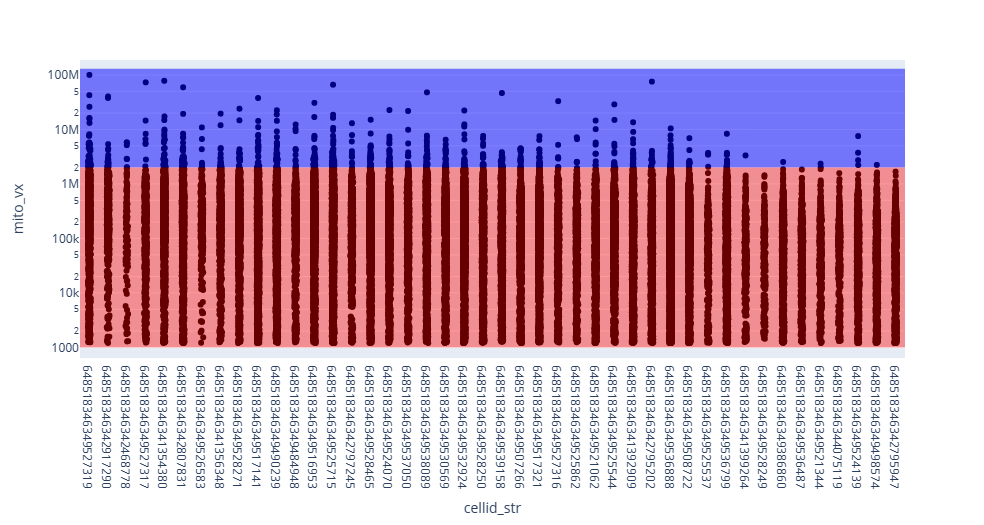

# Astrocyte Mitochondria
Visualization and analysis tools for analyzing mitochondria of astrocytes in the Layer 2/3 EM volume

***

# Summary Presentation

### View the [**Astrocyte Mitochondria**](https://github.com/shandran/layer23-volume/blob/main/astrocyte_mitochondria/astrocyte_mitochondria_visualization_and_analysis_summary_presentation.pdf) summary presentation file, with visualization examples of mitchondria in astrocytes.

***

# Contents

***

## Visualization tools

[`vtk_astrocyte_mitochondria_visualizer_using_threshold.ipynb`](https://github.com/shandran/layer23-volume/blob/main/astrocyte_mitochondria/vtk_astrocyte_mitochondria_visualizer_using_threshold.ipynb): Uses meshparty, vtk, and OpenGL to create an interactive 3D visualization of astrocyte mitochondria. A threshold variable colors mitochondria by number of voxels (default value used in these visualization was 2 million voxels); mitochondria above the threshold are colored blue and red for mitochondria below the threshold. Includes an option to save a high resolution png file.

[`astrocyte_mitochondria/astrocyte_mitochondria_3d_renderings` folder](https://github.com/shandran/layer23-volume/tree/main/astrocyte_mitochondria/astrocyte_mitochondria_3d_renderings): high resolution 3d renderings of 44 identified astrocytes in the Layer 2/3 volume using a coloring threshold of 2M voxels, as described above. See also pdf version: [`astrocyte_mitochondria_3drendings.pdf`](https://github.com/shandran/layer23-volume/blob/main/astrocyte_mitochondria/astrocyte_mitochondria_3drendings.pdf).

***

## A selection of interesting visualizations

### Astrocyte 648518346349527319
Neuroglancer visualization of all mitochondria in astrocyte 648518346349527319. This astrocyte contains the largest continuous mitochondria of all cells in the Layer 2/3 volume, in addition to several more very large and interconnected mitochondria.  

3D rendering of the same astrocyte, coloring mitochondria with a voxel size threshold (>2M voxels in blue and <2M voxels in red).  

### Astrocyte mitochondria analytics
Pareto stripplot of mitochondria voxel size in each astrocyte.

***
