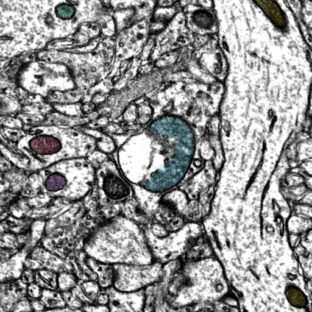

# Mitochondria Inclusions in Astrocytes
Visualization tools for mitochondria inclusions in astrocytes in the Layer 2/3 EM volume

***

# Summary Presentation

### View the [**Astrocyte Mitochondria Inclusions**](https://github.com/shandran/layer23-volume/blob/main/astrocyte_mitochondria_inclusions/Mitochondria_Inclusions_in_Astrocytes.pdf) summary presentation file, with visualization examples of mitchondria inclusions in astrocytes.

***

