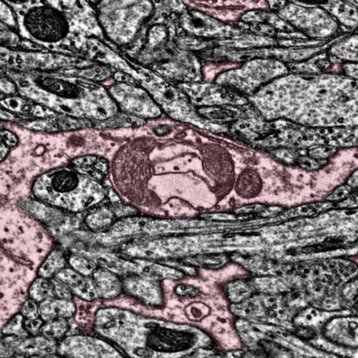

# Mitochondria Inclusions in Astrocytes
Visualization tools for mitochondria inclusions in astrocytes in the Layer 2/3 EM volume

***

# Summary Presentation

### View the [**Astrocyte Mitochondria Inclusions**](https://github.com/shandran/layer23-volume/blob/main/astrocyte_mitochondria_inclusions/Mitochondria_Inclusions_in_Astrocytes.pdf) summary presentation file, with visualization examples of mitchondria inclusions in astrocytes.

***

# Contents

***

## Visualization tools

[`EM_image_generator_master_astrocyte_inclusions.ipynb` notebook](https://github.com/shandran/layer23-volume/blob/main/astrocyte_mitochondria_inclusions/EM_image_generator_master_astrocyte_inclusions.ipynb): Uses cloudvolume and imageryclient libraries to create electron micrograph (EM) images from the Layer 2/3 volume. From Neuroglancer, grab the cellid and mitoid of interest, along with coordinates of the bottom and top slices. The notebook will create cell and mito segmentations, as well as options for creating single images, image stacks and image montages.

[`vtk_astrocyte_mitochondria_visualizer_using_threshold_with_neuroglancer_all_mitos.ipynb` notebook](vtk_astrocyte_mitochondria_visualizer_using_threshold_with_neuroglancer_all_mitos.ipynb): Uses meshparty, vtk, and OpenGL to create an interactive 3D visualization of astrocyte mitochondria. A threshold variable colors mitochondria by number of voxels (default value used in these visualization was 2 million voxels); mitochondria above the threshold are colored blue and red for mitochondria below the threshold. Includes an option to save a high resolution png file. This version also adds a neuroglancer link generator and a vtk visualizer that places the center of view on the mitoid centroid of interest.

***

## A selection of interesting visualizations

### EM cell segmentation using imageryclient

#### Astrocyte 648518346349527319 mito 980814 

### EM mitochondria segmentation using imageryclient

#### Astrocyte 648518346349538089 mito 2528399

### 3D visualization using vtk and OpenGL

#### Astrocyte mito

### Image montage generator

### Astrocyte mito
