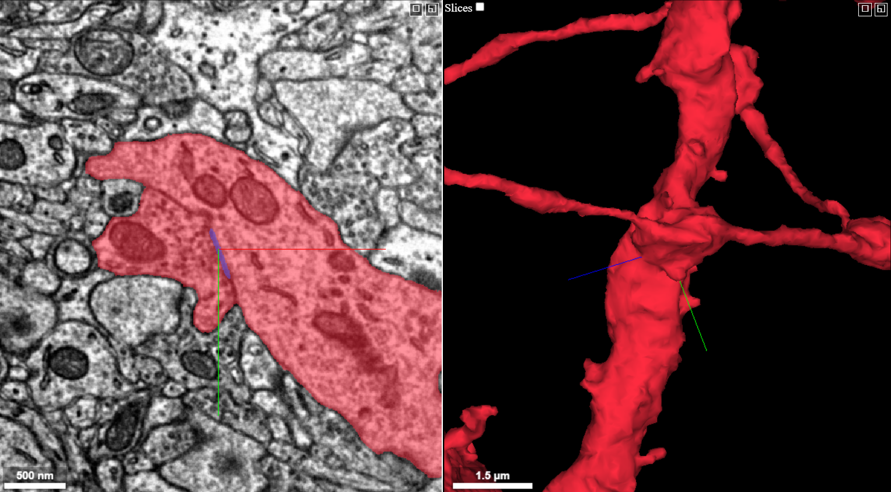
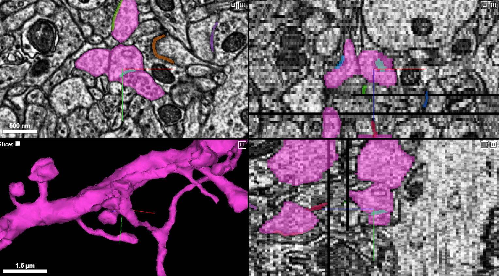
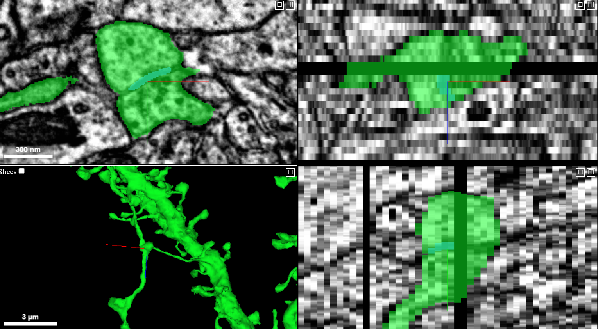
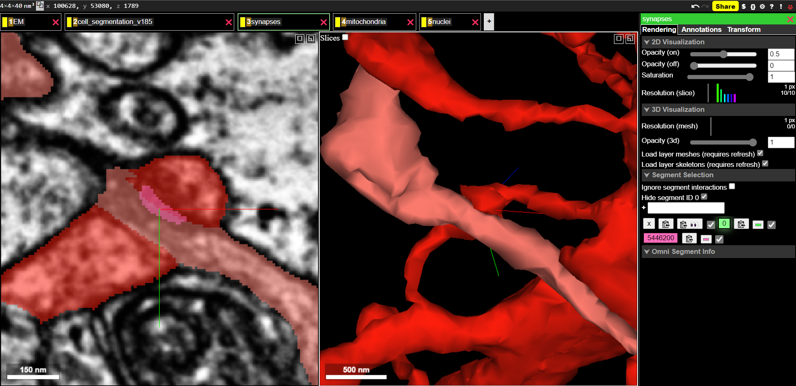
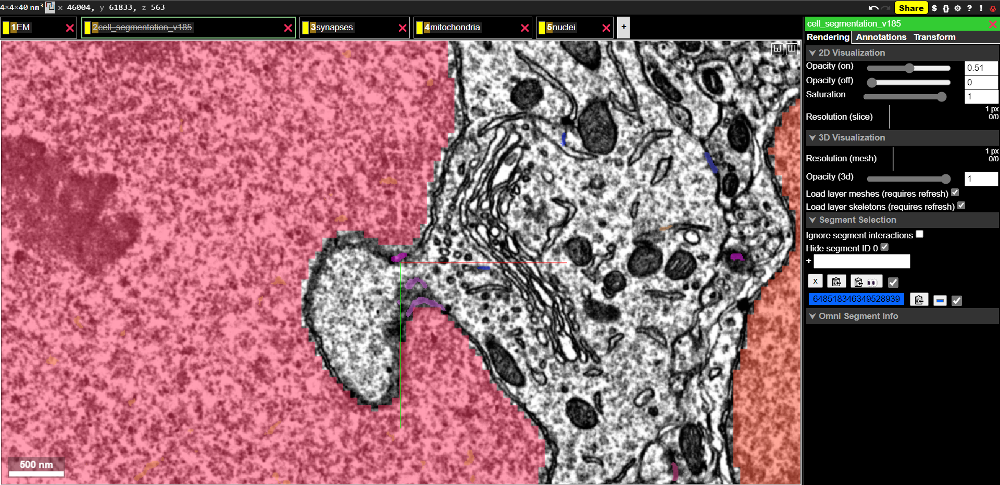
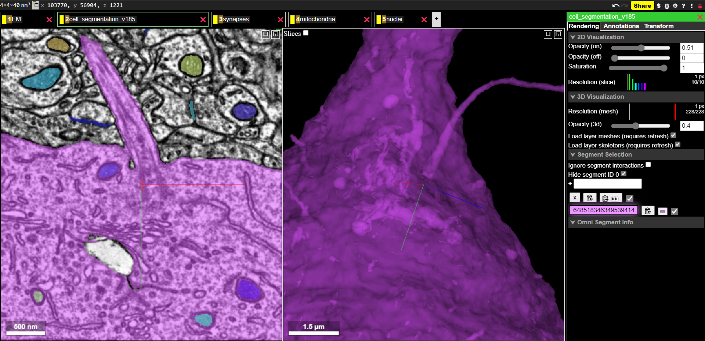

# Autapses in the Layer 2/3 volume
Analysis and visualization of neurons that form a synapse onto itself

***

# Contents

## Summary Presentation
### View the [Autapses summary presentation](https://github.com/shandran/layer23-volume/blob/main/autapses/autapses_layer23_summary_presentation.pdf).

***

## Notebooks and datatables

[`autapse_checker_entire_synapse_table.ipynb` notebook](https://github.com/shandran/layer23-volume/blob/main/autapses/autapse_checker_entire_synapse_table.ipynb): a simple method to identify potential autapses from the Layer 2/3 synapse table (pni_synapses_v185.csv).  

[`autapses_rm_nonneuronal.csv` datatable](https://github.com/shandran/layer23-volume/blob/main/autapses/autapses_rm_nonneuronal.csv): a human-curated (by me) data table that removed the vascular and glial cell ids. This resulted in a list of 27 potential neuronal autapses. The electron micrographs for each of these were manually checked in neuroglancer and 3 of the 24 were determined to be true autapses. The remaining 24 were due to segmentation errors or edge artifacts.  

[`autapses_layer23_volume.ipynb` notebook](https://github.com/shandran/layer23-volume/blob/main/autapses/autapses_layer23_volume.ipynb): analysis and visualization of the three true autapses as well as some example segmentation errors from the `autapses_rm_nonneuronal.csv` datatable.

***

## Visualization examples

### Autapse 3623767
In an inhibitory basket neuron (cell id 648518346349528994)

  

### Autapse 3966225
In an excitatory pyramidal neuron (cell id 648518346349538718)

  

### Autapse 5423743
In an excitatory pyramidal neuron (cell id 648518346349539853)

  

### Segmentation error examples

#### Two dendritic spines in contact with one another
Two dendritic spines from the same neuron in contact with one another where the synapse is assigned to the neuron; however upon inspection of the electron micrographs in Neuroglancer, there is an axon passing between the two spines and the segmentation algorithm failed to assign the synapse to the axon.  

  

#### Nuclear membrane segmentation error
A nuclear membrane mis-segmented as a synaptic membrane.  This particular example shows an invagination of the nuclear membrane that was interpreted by the segmentation algorithm as a synapse.  

  

#### Neuronal primary cilia segmentation error
The anchoring filament of a neuronal primary cilia is mis-segmented as a synapse.  

  
