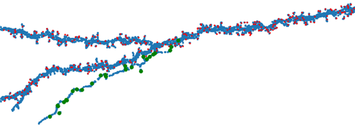
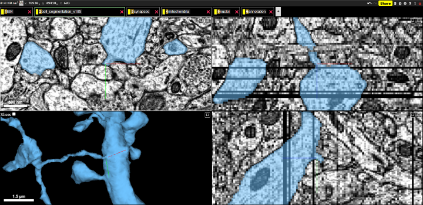
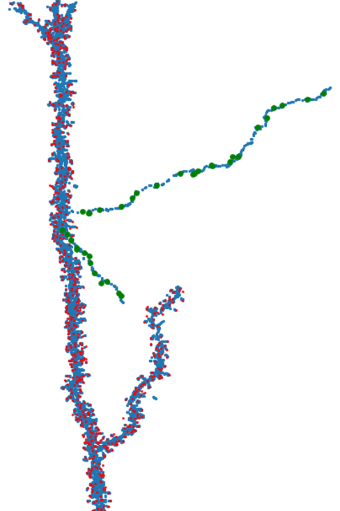
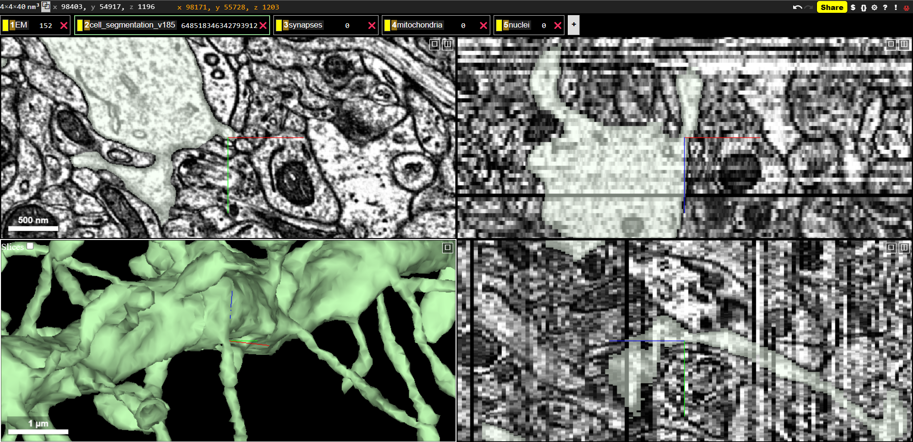
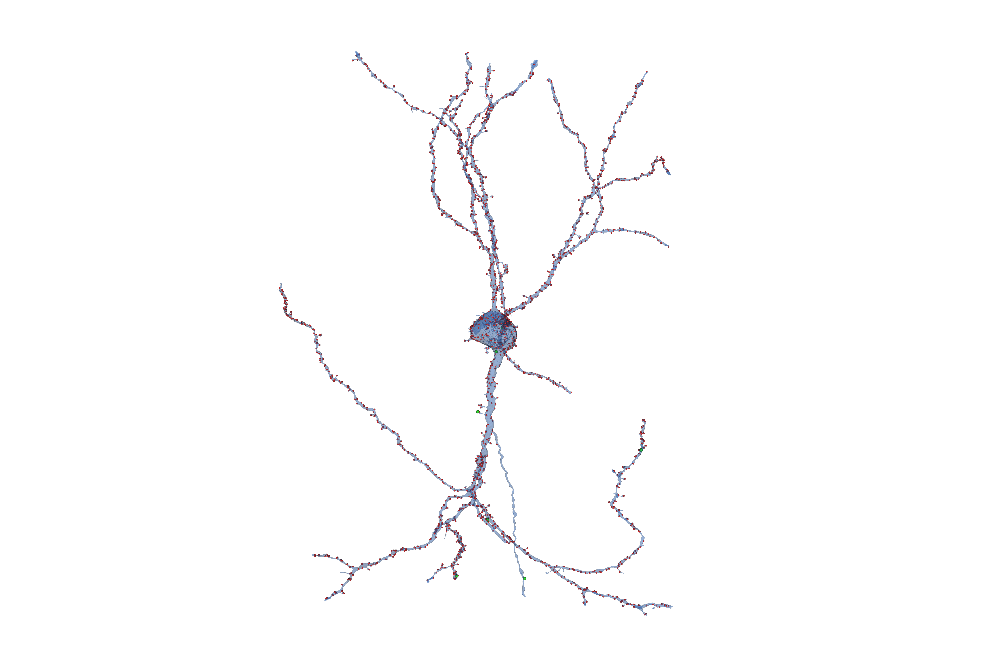
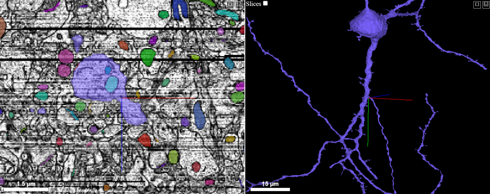

# Axon-Carrying Dendrites
Visualizations of likely axon-carrying dendrites in the Layer 2/3 serial EM volume

***

## Summary Presentation
View the summary presentation file: [`axon_carrying_dendrite_presentation.pdf`](https://github.com/shandran/layer23-volume/blob/main/axon_carrying_dendrite/axon_carrying_dendrite_presentation.pdf)

***

## Visualizations

## Case 1

#### View in [neuroglancer](https://neuromancer-seung-import.appspot.com/#!%7B%22layers%22:%5B%7B%22source%22:%22precomputed://gs://microns_public_datasets/pinky100_v0/son_of_alignment_v15_rechunked%22%2C%22type%22:%22image%22%2C%22blend%22:%22default%22%2C%22shaderControls%22:%7B%7D%2C%22name%22:%22EM%22%7D%2C%7B%22source%22:%22precomputed://gs://microns_public_datasets/pinky100_v185/seg%22%2C%22type%22:%22segmentation%22%2C%22selectedAlpha%22:0.51%2C%22segments%22:%5B%22648518346349536971%22%5D%2C%22skeletonRendering%22:%7B%22mode2d%22:%22lines_and_points%22%2C%22mode3d%22:%22lines%22%7D%2C%22name%22:%22cell_segmentation_v185%22%7D%2C%7B%22source%22:%22precomputed://matrix://sseung-archive/pinky100-clefts/mip1_d2_1175k%22%2C%22type%22:%22segmentation%22%2C%22skeletonRendering%22:%7B%22mode2d%22:%22lines_and_points%22%2C%22mode3d%22:%22lines%22%7D%2C%22name%22:%22synapses%22%7D%2C%7B%22source%22:%22precomputed://matrix://sseung-archive/pinky100-mito/seg_191220%22%2C%22type%22:%22segmentation%22%2C%22skeletonRendering%22:%7B%22mode2d%22:%22lines_and_points%22%2C%22mode3d%22:%22lines%22%7D%2C%22name%22:%22mitochondria%22%7D%2C%7B%22source%22:%22precomputed://matrix://sseung-archive/pinky100-nuclei/seg%22%2C%22type%22:%22segmentation%22%2C%22skeletonRendering%22:%7B%22mode2d%22:%22lines_and_points%22%2C%22mode3d%22:%22lines%22%7D%2C%22name%22:%22nuclei%22%7D%5D%2C%22navigation%22:%7B%22pose%22:%7B%22position%22:%7B%22voxelSize%22:%5B4%2C4%2C40%5D%2C%22voxelCoordinates%22:%5B74731.5546875%2C54819.9609375%2C1025.518310546875%5D%7D%7D%2C%22zoomFactor%22:383.0066650796121%7D%2C%22perspectiveOrientation%22:%5B-0.20825789868831635%2C-0.3129841387271881%2C0.4062955677509308%2C0.8328226208686829%5D%2C%22perspectiveZoom%22:871.3464965180995%2C%22showSlices%22:false%2C%22selectedLayer%22:%7B%22layer%22:%22cell_segmentation_v185%22%7D%2C%22layout%22:%7B%22type%22:%223d%22%2C%22orthographicProjection%22:true%7D%7D).

***

This reconstruction was made using the [`synapse_visualizer.ipynb` notebook](https://github.com/shandran/layer23-volume/blob/main/synapse_visualizer.ipynb). The post-synaptic sites (on the dendrites) are shown in red and the pre-synaptic sites (on the presumtive axon) are shown in green for cellid 648518346349536971.

***

### Raw Electron Micrographs show it is likely not a segmentation error
Review of the raw EM images, the presumptive axonal process is continuous with the dendrite and does not appear to be a segmentation error.

***

## Case 2

#### View in [Neuroglancer](https://neuromancer-seung-import.appspot.com/#!%7B%22layers%22:%5B%7B%22source%22:%22precomputed://gs://microns_public_datasets/pinky100_v0/son_of_alignment_v15_rechunked%22%2C%22type%22:%22image%22%2C%22blend%22:%22default%22%2C%22shaderControls%22:%7B%7D%2C%22name%22:%22EM%22%2C%22visible%22:false%7D%2C%7B%22source%22:%22precomputed://gs://microns_public_datasets/pinky100_v185/seg%22%2C%22type%22:%22segmentation%22%2C%22selectedAlpha%22:0.51%2C%22segments%22:%5B%22648518346342793912%22%5D%2C%22skeletonRendering%22:%7B%22mode2d%22:%22lines_and_points%22%2C%22mode3d%22:%22lines%22%7D%2C%22name%22:%22cell_segmentation_v185%22%7D%2C%7B%22source%22:%22precomputed://matrix://sseung-archive/pinky100-clefts/mip1_d2_1175k%22%2C%22type%22:%22segmentation%22%2C%22segments%22:%5B%220%22%5D%2C%22skeletonRendering%22:%7B%22mode2d%22:%22lines_and_points%22%2C%22mode3d%22:%22lines%22%7D%2C%22name%22:%22synapses%22%7D%2C%7B%22source%22:%22precomputed://matrix://sseung-archive/pinky100-mito/seg_191220%22%2C%22type%22:%22segmentation%22%2C%22segments%22:%5B%220%22%5D%2C%22skeletonRendering%22:%7B%22mode2d%22:%22lines_and_points%22%2C%22mode3d%22:%22lines%22%7D%2C%22name%22:%22mitochondria%22%7D%2C%7B%22source%22:%22precomputed://matrix://sseung-archive/pinky100-nuclei/seg%22%2C%22type%22:%22segmentation%22%2C%22skeletonRendering%22:%7B%22mode2d%22:%22lines_and_points%22%2C%22mode3d%22:%22lines%22%7D%2C%22name%22:%22nuclei%22%7D%5D%2C%22navigation%22:%7B%22pose%22:%7B%22position%22:%7B%22voxelSize%22:%5B4%2C4%2C40%5D%2C%22voxelCoordinates%22:%5B98403.109375%2C54917.546875%2C1196.9178466796875%5D%7D%7D%2C%22zoomFactor%22:5.984479141868939%7D%2C%22perspectiveOrientation%22:%5B0.11076418310403824%2C0.18521477282047272%2C-0.020076852291822433%2C0.9762293100357056%5D%2C%22perspectiveZoom%22:745.742083909727%2C%22showSlices%22:false%2C%22selectedLayer%22:%7B%22layer%22:%22cell_segmentation_v185%22%2C%22visible%22:true%7D%2C%22layout%22:%7B%22type%22:%223d%22%2C%22orthographicProjection%22:true%7D%7D)

This is another potential axon-carrying dendrite for cellid 648518346349536971. This is likely an L5 or L6 pyramidal neuron from a deeper layer below the Layer 2/3 volume. 

***

### Raw Electron Micrographs show it is likely not a segmentation error
Review of the raw EM images, the presumptive axonal process is continuous with the dendrite and does not appear to be a segmentation error.

***

## Case 3

#### View in [Neuroglancer](https://neuromancer-seung-import.appspot.com/#!%7B%22layers%22:%5B%7B%22source%22:%22precomputed://gs://microns_public_datasets/pinky100_v0/son_of_alignment_v15_rechunked%22%2C%22type%22:%22image%22%2C%22blend%22:%22default%22%2C%22shaderControls%22:%7B%7D%2C%22name%22:%22EM%22%7D%2C%7B%22source%22:%22precomputed://gs://microns_public_datasets/pinky100_v185/seg%22%2C%22type%22:%22segmentation%22%2C%22selectedAlpha%22:0.51%2C%22segments%22:%5B%22648518346349489861%22%5D%2C%22skeletonRendering%22:%7B%22mode2d%22:%22lines_and_points%22%2C%22mode3d%22:%22lines%22%7D%2C%22name%22:%22cell_segmentation_v185%22%7D%2C%7B%22source%22:%22precomputed://https://tigerdata.princeton.edu/sseung-archive/pinky100-clefts/mip1_d2_1175k%22%2C%22type%22:%22segmentation%22%2C%22skeletonRendering%22:%7B%22mode2d%22:%22lines_and_points%22%2C%22mode3d%22:%22lines%22%7D%2C%22name%22:%22synapses%22%7D%2C%7B%22source%22:%22precomputed://https://tigerdata.princeton.edu/sseung-archive/pinky100-mito/seg_191220%22%2C%22type%22:%22segmentation%22%2C%22skeletonRendering%22:%7B%22mode2d%22:%22lines_and_points%22%2C%22mode3d%22:%22lines%22%7D%2C%22name%22:%22mitochondria%22%7D%2C%7B%22source%22:%22precomputed://https://tigerdata.princeton.edu/sseung-archive/pinky100-nuclei/seg%22%2C%22type%22:%22segmentation%22%2C%22skeletonRendering%22:%7B%22mode2d%22:%22lines_and_points%22%2C%22mode3d%22:%22lines%22%7D%2C%22name%22:%22nuclei%22%7D%5D%2C%22navigation%22:%7B%22pose%22:%7B%22position%22:%7B%22voxelSize%22:%5B4%2C4%2C40%5D%2C%22voxelCoordinates%22:%5B104199%2C65434%2C892%5D%7D%7D%2C%22zoomFactor%22:13.504730544970997%7D%2C%22perspectiveOrientation%22:%5B-0.03958727419376373%2C-0.22549907863140106%2C-0.016111105680465698%2C0.9733054041862488%5D%2C%22perspectiveZoom%22:904.6914987128356%2C%22showSlices%22:false%2C%22selectedLayer%22:%7B%22layer%22:%22cell_segmentation_v185%22%7D%2C%22layout%22:%7B%22type%22:%22xz-3d%22%2C%22orthographicProjection%22:true%7D%7D).
3D reconstruction of bipolar inhibitory neuron withaxon-carrying dendrite. Pre-synaptic sites shown in green and post-synaptic sites shown in red.

***

Neuroglancer view of bipolar neuron with an axon-carrying dendrite.

***

## Wahle et al, ELife 2022
Axon-carrying dendrites (AcD) are not uncommon in rodents, with estimated 10-21% of pyramidal neurons having AcDs. See their [paper in eLife](https://elifesciences.org/articles/76101) entitled *Neocortical pyramidal neurons with axons emerging from dendrites are frequent in non-primates, but rare in monkey and human* for more details.
