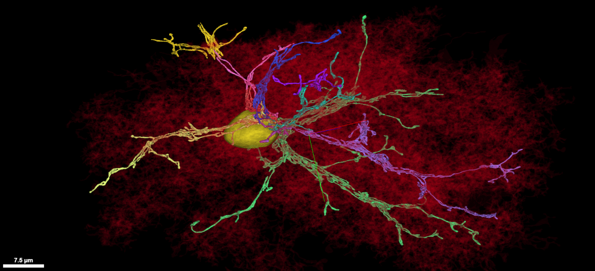

# Mitochondria in the Layer 2/3 Volume
Visualization and analysis of mitochondria by voxel (volume) and counts per cell.

A special thanks to Nick Turner for his advice and help. Read Nick and his Microns Consortium colleagues' Cell paper [*Reconstruction of neocortex: Organelles, compartments, cells, circuits, and activity*](https://www.sciencedirect.com/science/article/abs/pii/S0092867422001349) for more details.  

See the Microns explorer page at the [Allen Brain Institute](https://www.microns-explorer.org/terms-and-conditions) for more details, terms and conditions.

***

***

# Summary Presentation

### View the [**Mitochondria**](https://github.com/shandran/layer23-volume/blob/main/mitochondria/mitochondria_layer23_volume.pdf) summary presentation file, with lots of visualization examples of mitchondria in neurons and glia.

***

# Contents

## Anaconda Notebook files

The main analysis was conducted using [`mito_voxel_analysis_vasc_removed.ipynb`](https://github.com/shandran/layer23-volume/blob/main/mitochondria/mito_voxel_analysis_vasc_removed.ipynb). This notebook removes the vascular cells and all the partial processes from cells where the soma is not located in the volume. The cell subtypes table [`220309_cell_type_classification.csv`](https://github.com/shandran/layer23-volume/blob/main/data/220309_cell_type_classification.csv) was used to provide identifying information for the neuron or glial cell of interest.

Use [`mito_voxel_analysis_entire_table.ipynb`](https://github.com/shandran/layer23-volume/blob/main/mitochondria/mito_voxel_analysis_entire_table.ipynb) to look up mitochondria segmentation data on any cell id in the volume. This includes a substantial number of partial processes from cells where the soma is not located in the volume.

Note: The mitochondria table is too large to place on GitHub. You will need to download this file to your local computer in order to run these Anaconda notebook files.

***

# A selection of interesting visualizations

See the summary presentation for more examples and additional commentary.

## The largest mitochondrion in the volume

### View in [**neuroglancer**](https://neuromancer-seung-import.appspot.com/#!%7B%22layers%22:%5B%7B%22source%22:%22precomputed://gs://microns_public_datasets/pinky100_v0/son_of_alignment_v15_rechunked%22%2C%22type%22:%22image%22%2C%22blend%22:%22default%22%2C%22shaderControls%22:%7B%7D%2C%22name%22:%22EM%22%7D%2C%7B%22source%22:%22precomputed://gs://microns_public_datasets/pinky100_v185/seg%22%2C%22type%22:%22segmentation%22%2C%22selectedAlpha%22:0.51%2C%22objectAlpha%22:0.04%2C%22segments%22:%5B%22648518346349527319%22%5D%2C%22skeletonRendering%22:%7B%22mode2d%22:%22lines_and_points%22%2C%22mode3d%22:%22lines%22%7D%2C%22name%22:%22cell_segmentation_v185%22%7D%2C%7B%22source%22:%22precomputed://matrix://sseung-archive/pinky100-clefts/mip1_d2_1175k%22%2C%22type%22:%22segmentation%22%2C%22skeletonRendering%22:%7B%22mode2d%22:%22lines_and_points%22%2C%22mode3d%22:%22lines%22%7D%2C%22name%22:%22synapses%22%2C%22visible%22:false%7D%2C%7B%22source%22:%22precomputed://matrix://sseung-archive/pinky100-mito/seg_191220%22%2C%22type%22:%22segmentation%22%2C%22segments%22:%5B%221006877%22%2C%221006951%22%2C%221072958%22%2C%221073078%22%2C%221073147%22%2C%221073464%22%2C%221073521%22%2C%221073623%22%2C%221074216%22%2C%221074233%22%2C%221074763%22%2C%221074956%22%2C%221075671%22%2C%221075680%22%2C%221076077%22%2C%221077051%22%2C%221077182%22%2C%221077278%22%2C%221077300%22%2C%221077394%22%2C%221077506%22%2C%221077607%22%2C%221077677%22%2C%221077732%22%2C%221077738%22%2C%221078278%22%2C%221078398%22%2C%221078416%22%2C%221078439%22%2C%221078535%22%2C%221078608%22%2C%221078697%22%2C%221079307%22%2C%221079683%22%2C%221079778%22%2C%221079961%22%2C%221080190%22%2C%221080311%22%2C%221080801%22%2C%221081129%22%2C%221081382%22%2C%221081808%22%2C%221081852%22%2C%221082444%22%2C%221082461%22%2C%221082518%22%2C%221082674%22%2C%221082707%22%2C%221082818%22%2C%221083260%22%2C%221083364%22%2C%221083380%22%2C%221083407%22%2C%221083414%22%2C%221083417%22%2C%221083461%22%2C%221083473%22%2C%221083481%22%2C%221083521%22%2C%221083568%22%2C%221083591%22%2C%221083602%22%2C%221083628%22%2C%221083650%22%2C%221083667%22%2C%221083671%22%2C%221083709%22%2C%221083716%22%2C%221083734%22%2C%221084631%22%2C%221085035%22%2C%221085107%22%2C%221085163%22%2C%221085372%22%2C%221085535%22%2C%221086473%22%2C%221086664%22%2C%221086732%22%2C%221086929%22%2C%221087109%22%2C%221087190%22%2C%221087299%22%2C%221087495%22%2C%221087523%22%2C%221087533%22%2C%221087568%22%2C%221087613%22%2C%221087639%22%2C%221087670%22%2C%221087694%22%2C%221087718%22%2C%221087760%22%2C%221087773%22%2C%221087776%22%2C%221087791%22%2C%221087812%22%2C%221087859%22%2C%221090465%22%2C%221090623%22%2C%221091085%22%2C%221091090%22%2C%221091778%22%2C%221091967%22%2C%221092484%22%2C%221106062%22%2C%221109813%22%2C%221110166%22%2C%221113881%22%2C%221114039%22%2C%221119570%22%2C%221184576%22%2C%221184795%22%2C%221184909%22%2C%221185007%22%2C%221185618%22%2C%221186078%22%2C%221187213%22%2C%221188229%22%2C%221188346%22%2C%221188507%22%2C%221189034%22%2C%221189040%22%2C%221189083%22%2C%221189104%22%2C%221189191%22%2C%221189265%22%2C%221189397%22%2C%221189492%22%2C%221189495%22%2C%221189587%22%2C%221189599%22%2C%221189690%22%2C%221189708%22%2C%221189916%22%2C%221190017%22%2C%221190031%22%2C%221190086%22%2C%221190093%22%2C%221190124%22%2C%221190129%22%2C%221190250%22%2C%221190380%22%2C%221190453%22%2C%221190699%22%2C%221190782%22%2C%221190800%22%2C%221191458%22%2C%221191815%22%2C%221192002%22%2C%221193097%22%2C%221193148%22%2C%221193214%22%2C%221193695%22%2C%221193703%22%2C%221193712%22%2C%221193715%22%2C%221193728%22%2C%221193772%22%2C%221193804%22%2C%221193807%22%2C%221193811%22%2C%221193856%22%2C%221193896%22%2C%221193923%22%2C%221193936%22%2C%221193974%22%2C%221193976%22%2C%221194040%22%2C%221194062%22%2C%221194237%22%2C%221194270%22%2C%221194337%22%2C%221194456%22%2C%221194458%22%2C%221194723%22%2C%221194735%22%2C%221194759%22%2C%221194918%22%2C%221194937%22%2C%221195120%22%2C%221195389%22%2C%221195431%22%2C%221195448%22%2C%221195470%22%2C%221195490%22%2C%221195500%22%2C%221196005%22%2C%221196009%22%2C%221196154%22%2C%221196280%22%2C%221196304%22%2C%221196502%22%2C%221197761%22%2C%221198162%22%2C%221198654%22%2C%221198717%22%2C%221198729%22%2C%221198794%22%2C%221199068%22%2C%221199584%22%2C%221199617%22%2C%221199826%22%2C%221202565%22%2C%221202667%22%2C%221202689%22%2C%221202758%22%2C%221202773%22%2C%221202794%22%2C%221202964%22%2C%221203167%22%2C%221203273%22%2C%221203299%22%2C%221203311%22%2C%221203337%22%2C%221203562%22%2C%221203667%22%2C%221203697%22%2C%221203810%22%2C%221204064%22%2C%221204267%22%2C%221205758%22%2C%221206740%22%2C%221207170%22%2C%221207394%22%2C%221207401%22%2C%221207512%22%2C%221207551%22%2C%221207591%22%2C%221207633%22%2C%221207885%22%2C%221208389%22%2C%221208837%22%2C%221209147%22%2C%221213420%22%2C%221295403%22%2C%221296180%22%2C%221297487%22%2C%221298355%22%2C%221298463%22%2C%221298567%22%2C%221300104%22%2C%221300119%22%2C%221300255%22%2C%221300303%22%2C%221300315%22%2C%221300342%22%2C%221300757%22%2C%221300790%22%2C%221300891%22%2C%221301203%22%2C%221301233%22%2C%221301290%22%2C%221301477%22%2C%221301531%22%2C%221301737%22%2C%221302007%22%2C%221302065%22%2C%221302158%22%2C%221302265%22%2C%221302771%22%2C%221303065%22%2C%221303136%22%2C%221303254%22%2C%221303577%22%2C%221303823%22%2C%221303971%22%2C%221304222%22%2C%221304226%22%2C%221304307%22%2C%221304771%22%2C%221304788%22%2C%221304826%22%2C%221304911%22%2C%221305083%22%2C%221305089%22%2C%221305423%22%2C%221305432%22%2C%221305485%22%2C%221305493%22%2C%221305496%22%2C%221305576%22%2C%221305707%22%2C%221305960%22%2C%221306099%22%2C%221306120%22%2C%221306162%22%2C%221306216%22%2C%221306281%22%2C%221306360%22%2C%221306408%22%2C%221306536%22%2C%221306628%22%2C%221306687%22%2C%221306855%22%2C%221306945%22%2C%221306981%22%2C%221307014%22%2C%221307019%22%2C%221307653%22%2C%221307744%22%2C%221308697%22%2C%221308821%22%2C%221309048%22%2C%221309136%22%2C%221309305%22%2C%221309440%22%2C%221309704%22%2C%221309739%22%2C%221310095%22%2C%221310172%22%2C%221310428%22%2C%221310459%22%2C%221310514%22%2C%221310589%22%2C%221311173%22%2C%221311869%22%2C%221312538%22%2C%221313542%22%2C%221313544%22%2C%221313855%22%2C%221314433%22%2C%221314505%22%2C%221314608%22%2C%221314717%22%2C%221314804%22%2C%221314834%22%2C%221314949%22%2C%221315133%22%2C%221315144%22%2C%221315543%22%2C%221315578%22%2C%221315661%22%2C%221315749%22%2C%221315835%22%2C%221316054%22%2C%221319100%22%2C%221319164%22%2C%221319959%22%2C%221320027%22%2C%221320088%22%2C%221320159%22%2C%221320249%22%2C%221320371%22%2C%221320448%22%2C%221320485%22%2C%221320599%22%2C%221320748%22%2C%221320832%22%2C%221321258%22%2C%221323697%22%2C%221324424%22%2C%221324490%22%2C%221324727%22%2C%221324803%22%2C%221324920%22%2C%221325046%22%2C%221325093%22%2C%221325286%22%2C%221325828%22%2C%221328759%22%2C%221329274%22%2C%221414755%22%2C%221415637%22%2C%221415676%22%2C%221415711%22%2C%221415758%22%2C%221416599%22%2C%221417339%22%2C%221417734%22%2C%221417848%22%2C%221418189%22%2C%221418236%22%2C%221418362%22%2C%221418432%22%2C%221418468%22%2C%221418476%22%2C%221418738%22%2C%221418841%22%2C%221419720%22%2C%221419743%22%2C%221419797%22%2C%221420056%22%2C%221420116%22%2C%221420723%22%2C%221420751%22%2C%221420896%22%2C%221421003%22%2C%221421106%22%2C%221421206%22%2C%221421312%22%2C%221422145%22%2C%221422151%22%2C%221422159%22%2C%221422236%22%2C%221422270%22%2C%221422321%22%2C%221422340%22%2C%221422416%22%2C%221422422%22%2C%221422478%22%2C%221422483%22%2C%221422563%22%2C%221422595%22%2C%221422761%22%2C%221422855%22%2C%221422864%22%2C%221422894%22%2C%221422968%22%2C%221423219%22%2C%221423266%22%2C%221423269%22%2C%221423294%22%2C%221423428%22%2C%221423465%22%2C%221423476%22%2C%221423674%22%2C%221423753%22%2C%221423763%22%2C%221423911%22%2C%221423978%22%2C%221424075%22%2C%221424154%22%2C%221424155%22%2C%221424174%22%2C%221424453%22%2C%221424486%22%2C%221424524%22%2C%221424589%22%2C%221424650%22%2C%221424984%22%2C%221425000%22%2C%221425361%22%2C%221425429%22%2C%221425450%22%2C%221425518%22%2C%221425599%22%2C%221425771%22%2C%221426678%22%2C%221426707%22%2C%221427008%22%2C%221427017%22%2C%221427136%22%2C%221427149%22%2C%221427179%22%2C%221427188%22%2C%221427220%22%2C%221427247%22%2C%221427248%22%2C%221427280%22%2C%221427309%22%2C%221427354%22%2C%221427359%22%2C%221427719%22%2C%221427755%22%2C%221427757%22%2C%221427820%22%2C%221427925%22%2C%221427934%22%2C%221428094%22%2C%221428143%22%2C%221428534%22%2C%221428568%22%2C%221428576%22%2C%221428590%22%2C%221429389%22%2C%221430674%22%2C%221430700%22%2C%221430753%22%2C%221430993%22%2C%221431039%22%2C%221431073%22%2C%221431118%22%2C%221431185%22%2C%221431186%22%2C%221431214%22%2C%221431270%22%2C%221431279%22%2C%221431299%22%2C%221431313%22%2C%221431344%22%2C%221431395%22%2C%221431524%22%2C%221431678%22%2C%221431769%22%2C%221432029%22%2C%221432084%22%2C%221432085%22%2C%221432241%22%2C%221432286%22%2C%221432310%22%2C%221432418%22%2C%221435015%22%2C%221435069%22%2C%221435148%22%2C%221435443%22%2C%221436190%22%2C%221436266%22%2C%221436315%22%2C%221436342%22%2C%221436385%22%2C%221436418%22%2C%221436426%22%2C%221436449%22%2C%221436455%22%2C%221436559%22%2C%221436561%22%2C%221436601%22%2C%221436614%22%2C%221436654%22%2C%221439342%22%2C%221439536%22%2C%221439977%22%2C%221440289%22%2C%221440814%22%2C%221443123%22%2C%221532613%22%2C%221532726%22%2C%221533361%22%2C%221533408%22%2C%221533707%22%2C%221534223%22%2C%221535187%22%2C%221535312%22%2C%221535623%22%2C%221535800%22%2C%221535890%22%2C%221535998%22%2C%221536296%22%2C%221537654%22%2C%221537848%22%2C%221538102%22%2C%221538170%22%2C%221538523%22%2C%221538547%22%2C%221538615%22%2C%221538683%22%2C%221541333%22%2C%221541868%22%2C%221542118%22%2C%221542137%22%2C%221542243%22%2C%221542409%22%2C%221542482%22%2C%221542503%22%2C%221542525%22%2C%221542675%22%2C%221542736%22%2C%221542816%22%2C%221542881%22%2C%221543200%22%2C%221543327%22%2C%221543540%22%2C%221543604%22%2C%221543682%22%2C%221543740%22%2C%221544222%22%2C%221544806%22%2C%221545114%22%2C%221546442%22%2C%221546485%22%2C%221546547%22%2C%221546586%22%2C%221546627%22%2C%221546699%22%2C%221546893%22%2C%221547001%22%2C%221547113%22%2C%221547252%22%2C%221547463%22%2C%221547617%22%2C%221547634%22%2C%221550553%22%2C%221550586%22%2C%221550628%22%2C%221550652%22%2C%221550718%22%2C%221550795%22%2C%221550808%22%2C%221550865%22%2C%221551039%22%2C%221551074%22%2C%221551097%22%2C%221551229%22%2C%221551235%22%2C%221551567%22%2C%221551631%22%2C%221551801%22%2C%221551887%22%2C%221551988%22%2C%221552059%22%2C%221552250%22%2C%221554676%22%2C%221555068%22%2C%221555550%22%2C%221555906%22%2C%221653544%22%2C%221653901%22%2C%221653911%22%2C%221654097%22%2C%221654178%22%2C%221654550%22%2C%221655164%22%2C%221658028%22%2C%221658075%22%2C%221658160%22%2C%221658185%22%2C%221658252%22%2C%221658377%22%2C%221658551%22%2C%221658563%22%2C%221658751%22%2C%221658777%22%2C%221659180%22%2C%221659318%22%2C%221659415%22%2C%221659418%22%2C%221659428%22%2C%221659507%22%2C%221659738%22%2C%221659830%22%2C%221660954%22%2C%221661414%22%2C%221661425%22%2C%221661481%22%2C%221661546%22%2C%221662292%22%2C%221662383%22%2C%221662534%22%2C%221662641%22%2C%221662659%22%2C%221662823%22%2C%221662913%22%2C%221663078%22%2C%221663092%22%2C%221663308%22%2C%221663318%22%2C%221663336%22%2C%221663529%22%2C%221663666%22%2C%221664011%22%2C%221664132%22%2C%221664208%22%2C%221664300%22%2C%221664351%22%2C%221665269%22%2C%221667029%22%2C%221667152%22%2C%221667490%22%2C%221668136%22%2C%221670248%22%2C%221776443%22%2C%221776503%22%2C%221781574%22%2C%221781779%22%2C%221782007%22%2C%221785755%22%2C%221785758%22%2C%221785981%22%2C%221786057%22%2C%221786092%22%2C%221786222%22%2C%221786523%22%2C%22688206%22%2C%22688238%22%2C%22688505%22%2C%22739489%22%2C%22744347%22%2C%22746580%22%2C%22747175%22%2C%22747345%22%2C%22747392%22%2C%22751127%22%2C%22751735%22%2C%22751759%22%2C%22751902%22%2C%22755907%22%2C%22755930%22%2C%22776922%22%2C%22781901%22%2C%22782044%22%2C%22782075%22%2C%22782353%22%2C%22786353%22%2C%22786364%22%2C%22843952%22%2C%22845983%22%2C%22847050%22%2C%22847278%22%2C%22847991%22%2C%22848156%22%2C%22848512%22%2C%22848693%22%2C%22848933%22%2C%22849018%22%2C%22849575%22%2C%22849659%22%2C%22849765%22%2C%22850031%22%2C%22850112%22%2C%22851916%22%2C%22851979%22%2C%22852177%22%2C%22852296%22%2C%22852528%22%2C%22852656%22%2C%22853680%22%2C%22854433%22%2C%22854634%22%2C%22854721%22%2C%22854834%22%2C%22854921%22%2C%22855057%22%2C%22855172%22%2C%22855487%22%2C%22856142%22%2C%22857091%22%2C%22857646%22%2C%22858018%22%2C%22858759%22%2C%22859032%22%2C%22859446%22%2C%22859792%22%2C%22860211%22%2C%22860322%22%2C%22860397%22%2C%22860462%22%2C%22860510%22%2C%22860602%22%2C%22862219%22%2C%22862234%22%2C%22862778%22%2C%22863346%22%2C%22863814%22%2C%22864141%22%2C%22864482%22%2C%22866030%22%2C%22866141%22%2C%22866350%22%2C%22866697%22%2C%22867693%22%2C%22867796%22%2C%22871481%22%2C%22871585%22%2C%22871711%22%2C%22872023%22%2C%22872091%22%2C%22876712%22%2C%22885594%22%2C%22885880%22%2C%22957144%22%2C%22960833%22%2C%22960925%22%2C%22961262%22%2C%22961589%22%2C%22961924%22%2C%22961982%22%2C%22961986%22%2C%22962105%22%2C%22963261%22%2C%22963311%22%2C%22963445%22%2C%22963465%22%2C%22963489%22%2C%22963529%22%2C%22963534%22%2C%22963566%22%2C%22963571%22%2C%22963587%22%2C%22963606%22%2C%22963614%22%2C%22963622%22%2C%22963627%22%2C%22963679%22%2C%22963717%22%2C%22963728%22%2C%22963962%22%2C%22963993%22%2C%22964170%22%2C%22964236%22%2C%22964318%22%2C%22964336%22%2C%22964835%22%2C%22965840%22%2C%22965940%22%2C%22966116%22%2C%22966153%22%2C%22966479%22%2C%22966636%22%2C%22966928%22%2C%22966950%22%2C%22966951%22%2C%22966962%22%2C%22967020%22%2C%22967070%22%2C%22967121%22%2C%22967128%22%2C%22967379%22%2C%22967384%22%2C%22967688%22%2C%22968143%22%2C%22968223%22%2C%22968231%22%2C%22968474%22%2C%22968475%22%2C%22968606%22%2C%22968772%22%2C%22968794%22%2C%22968817%22%2C%22968852%22%2C%22968860%22%2C%22968866%22%2C%22968900%22%2C%22968981%22%2C%22969703%22%2C%22970820%22%2C%22971004%22%2C%22971035%22%2C%22971069%22%2C%22971119%22%2C%22971186%22%2C%22971462%22%2C%22971867%22%2C%22971885%22%2C%22971986%22%2C%22972074%22%2C%22972102%22%2C%22972115%22%2C%22972153%22%2C%22972277%22%2C%22972387%22%2C%22972734%22%2C%22973044%22%2C%22974233%22%2C%22975259%22%2C%22975319%22%2C%22975628%22%2C%22975726%22%2C%22975805%22%2C%22976602%22%2C%22976682%22%2C%22976981%22%2C%22977761%22%2C%22980282%22%2C%22980308%22%2C%22980311%22%2C%22980430%22%2C%22980814%22%2C%22980899%22%2C%22981223%22%2C%22981389%22%2C%22981627%22%2C%22981847%22%2C%22982071%22%2C%22982112%22%2C%22982199%22%2C%22984986%22%2C%22985366%22%2C%22985445%22%2C%22985701%22%2C%22985925%22%2C%22985928%22%2C%22986091%22%2C%22986361%22%2C%22989987%22%2C%22990342%22%2C%22990789%22%2C%22991111%22%2C%22994728%22%5D%2C%22skeletonRendering%22:%7B%22mode2d%22:%22lines_and_points%22%2C%22mode3d%22:%22lines%22%7D%2C%22name%22:%22mitochondria%22%7D%2C%7B%22source%22:%22precomputed://matrix://sseung-archive/pinky100-nuclei/seg%22%2C%22type%22:%22segmentation%22%2C%22selectedAlpha%22:0.33%2C%22objectAlpha%22:0.44%2C%22segments%22:%5B%224308%22%5D%2C%22skeletonRendering%22:%7B%22mode2d%22:%22lines_and_points%22%2C%22mode3d%22:%22lines%22%7D%2C%22name%22:%22nuclei%22%7D%5D%2C%22navigation%22:%7B%22pose%22:%7B%22position%22:%7B%22voxelSize%22:%5B4%2C4%2C40%5D%2C%22voxelCoordinates%22:%5B63517.98046875%2C42337.02734375%2C1254.7318115234375%5D%7D%7D%2C%22zoomFactor%22:23.937916567475757%7D%2C%22perspectiveOrientation%22:%5B0%2C-0.7071067690849304%2C0%2C0.7071067690849304%5D%2C%22perspectiveZoom%22:722.3512001466489%2C%22showSlices%22:false%2C%22selectedLayer%22:%7B%22layer%22:%22mitochondria%22%2C%22visible%22:true%7D%2C%22layout%22:%7B%22type%22:%223d%22%2C%22orthographicProjection%22:true%7D%7D). 

Note that the load time is long.  

The largest contiguous mitochondria by voxel size is within an astrocyte in the Layer 2/3 volume.

## The neuron with the largest contiguous mitochondrion in the volume

### View in [**neuroglancer**](https://neuromancer-seung-import.appspot.com/#!%7B%22layers%22:%5B%7B%22source%22:%22precomputed://gs://microns_public_datasets/pinky100_v0/son_of_alignment_v15_rechunked%22%2C%22type%22:%22image%22%2C%22blend%22:%22default%22%2C%22shaderControls%22:%7B%7D%2C%22name%22:%22EM%22%7D%2C%7B%22source%22:%22precomputed://gs://microns_public_datasets/pinky100_v185/seg%22%2C%22type%22:%22segmentation%22%2C%22selectedAlpha%22:0.51%2C%22objectAlpha%22:0.1%2C%22segments%22:%5B%22648518346349537741%22%5D%2C%22skeletonRendering%22:%7B%22mode2d%22:%22lines_and_points%22%2C%22mode3d%22:%22lines%22%7D%2C%22shatterSegmentEquivalences%22:true%2C%22name%22:%22cell_segmentation_v185%22%7D%2C%7B%22source%22:%22precomputed://matrix://sseung-archive/pinky100-clefts/mip1_d2_1175k%22%2C%22type%22:%22segmentation%22%2C%22skeletonRendering%22:%7B%22mode2d%22:%22lines_and_points%22%2C%22mode3d%22:%22lines%22%7D%2C%22shatterSegmentEquivalences%22:true%2C%22name%22:%22synapses%22%7D%2C%7B%22source%22:%22precomputed://matrix://sseung-archive/pinky100-mito/seg_191220%22%2C%22type%22:%22segmentation%22%2C%22segmentColors%22:%7B%222130887%22:%22#ff7ac1%22%2C%2215339984%22:%22#ff70cb%22%7D%2C%22segments%22:%5B%222130887%22%5D%2C%22skeletonRendering%22:%7B%22mode2d%22:%22lines_and_points%22%2C%22mode3d%22:%22lines%22%7D%2C%22shatterSegmentEquivalences%22:true%2C%22name%22:%22mitochondria%22%7D%2C%7B%22source%22:%22precomputed://matrix://sseung-archive/pinky100-nuclei/seg%22%2C%22type%22:%22segmentation%22%2C%22skeletonRendering%22:%7B%22mode2d%22:%22lines_and_points%22%2C%22mode3d%22:%22lines%22%7D%2C%22shatterSegmentEquivalences%22:true%2C%22name%22:%22nuclei%22%7D%5D%2C%22navigation%22:%7B%22pose%22:%7B%22position%22:%7B%22voxelSize%22:%5B4%2C4%2C40%5D%2C%22voxelCoordinates%22:%5B86814.453125%2C49071.70703125%2C1580.8717041015625%5D%7D%7D%2C%22zoomFactor%22:383.0066650796121%7D%2C%22showAxisLines%22:false%2C%22showScaleBar%22:false%2C%22showDefaultAnnotations%22:false%2C%22perspectiveOrientation%22:%5B-0.01075825933367014%2C-0.46638745069503784%2C0.11617939919233322%2C0.8768519759178162%5D%2C%22perspectiveZoom%22:993.4596316365761%2C%22selectedLayer%22:%7B%22layer%22:%22mitochondria%22%7D%2C%22layout%22:%7B%22type%22:%223d%22%2C%22orthographicProjection%22:true%7D%7D).

This excitatory pyramidal neuron has the largest contiguous mitochondrion by voxels (volume) for a neuron in the Layer 2/3 volume.  

## The neuron with the highest number of mitochondria by count

### View in [**neuroglancer**](https://docs.google.com/document/d/133_EKYGLfdr3YN5eiZA6mDrlXz2uFvgNwqV_-QTA-Wg/edit?usp=sharing). 

The hyperlink is so large that I had to create a Google Doc to contain it. Clicking on the hyperlink will open Neuroglancer; please note that the load time is long.  

This inhibitory basket neuron (648518346349539215) has 3213 mitochondria and is also the neuron with the most pre-synaptic contacts in the volume. See [`most_synapses` folder](https://github.com/shandran/layer23-volume/commit/35997e379f7317b9183c58d8e9411344da5f7878) for visualization of the synaptic sites on this neuron.  

