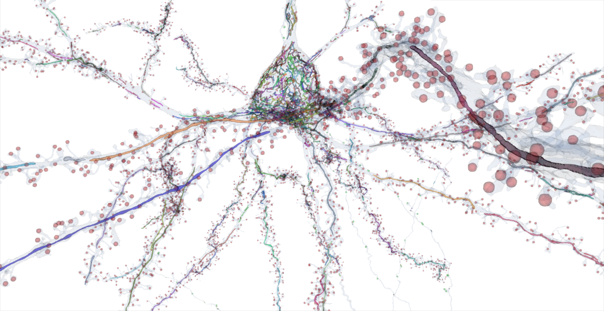

# Mitochondria analytics
Visualization and analysis tools for analyzing mitochondria in the Layer 2/3 EM volume

***

# Contents

## Visualization tools

### Visualize a single mitochondrion of interest in Neuroglancer

[`neuroglancer_link_generator_mitochondria_visualization_version.ipynb`](https://github.com/shandran/layer23-volume/blob/main/mitochondria_analytics/neuroglancer_link_generator_mitochondria_visualization_version.ipynb): generate a Neuroglancer link for a single cellid and single mitochondrion from the `pni_mito_cellswskel_v185_fullstats.csv` datatable. The view will be centered at the centroid of the mitochondrion in the volume.

***

### Visualize all mitochondria in a neuron of interest in Neuroglancer

[`neuroglancer_link_generator_all_mitochondria.ipynb`](https://github.com/shandran/layer23-volume/blob/main/mitochondria_analytics/neuroglancer_link_generator_all_mitochondria.ipynb): generate a Neuroglancer link for all the mitochondria in a single cellid of interest pulling the mito ids from the `211019_mitochondria_info.csv` datatable.

### Visualize neuronal mitochondria by compartment in Neuroglancer

[`neuroglancer_link_generator_neuronalmitochondria_bycompartment.ipynb`](https://github.com/shandran/layer23-volume/blob/main/mitochondria_analytics/neuroglancer_link_generator_neuronalmitochondria_bycompartment.ipynb): as above, but allows to select for a compartment of interest. Neuronal compartment assignments are based on the method described by *Reconstruction of neocortex: Organelles, compartments, cells, circuits, and activity* [Turner et al, Cell 2022](https://www.sciencedirect.com/science/article/abs/pii/S0092867422001349).

### 3D visualizer of all mitochondria in a cell of interesting using Meshparty, vtk, and OpenGL viewer

[`vtk_mitochondria_visualizer.ipynb`](https://github.com/shandran/layer23-volume/blob/main/mitochondria_analytics/vtk_mitochondria_visualizer.ipynb): generate a 3D interactive view of all mitochondria in a cell of interest. Note this method has significant file download and space requirements compared to using the Neuroglancer viewer.

### 3D visualizer of all mitochondria and synapses in a cell of interesting using Meshparty, vtk, and OpenGL viewer

[`vtk_mitochondria_visualizer_with_synapses.ipynb`](https://github.com/shandran/layer23-volume/blob/main/mitochondria_analytics/vtk_mitochondria_visualizer_with_synapses.ipynb): generate a 3D interactive view of all mitochondria in a cell of interest along with the pre- and post-syanptic sites. Note this method has significant file download and space requirements compared to using the Neuroglancer viewer.

### 3D vector plots by cellid lookup by neuronal subtype

[`mitochondria_3d_vector_plots_by_cellid_lookup_by_neuronal_subtype.ipynb`](https://github.com/shandran/layer23-volume/blob/main/mitochondria_analytics/mitochondria_3d_vector_plots_by_cellid_lookup_by_neuronal_subtype.ipynb): generate 3D interactive scatterplots in Plotly, 3D quiver plots in matplotlib, and a Neuroglancer views with this notebook. Uses a dataframe that generates spatial and vector calculations from the original mitochondria dataframe by Turner et al. Download `mito_above_soma.csv` in the [data folder](https://github.com/shandran/layer23-volume/blob/main/mitochondria_analytics/data/mito_above_soma.csv).

### 3D visualization for mitochondria within a 45 degree cone above soma

[`3dvisualizer_for_withincone.ipynb`](https://github.com/shandran/layer23-volume/blob/main/mitochondria_analytics/3dvisualizer_for_withincone.ipynb): generate 3D interactive scatterplots in Plotly, 3D quiver plots in matplotlib, and Neuroglancer views with this notebook. Uses a dataframe that generates spatial, vector, and cone angle calculations from the original mitochondria dataframe by Turner et al. Download `pyr_all.csv` in the [data folder](https://github.com/shandran/layer23-volume/blob/main/mitochondria_analytics/data/pyr_all.csv). Special thanks to Qiao Liu and Wanwen Zeng at Stanford for their assistance in debugging the code.

### Nodeplot for mitochondria segmentation node metrics
Example nodeplot (nodeid vs. nodedist by compartment color) for pyramidal neuron cellid 648518346349537297. This example shows that certain mitochondria where the compartment is unidentified could potentially be inferred from the mitochondria node metrics data. See also [`node_metrics` folder](https://github.com/shandran/layer23-volume/tree/main/mitochondria_analytics/node_metrics) for additional details.

***

