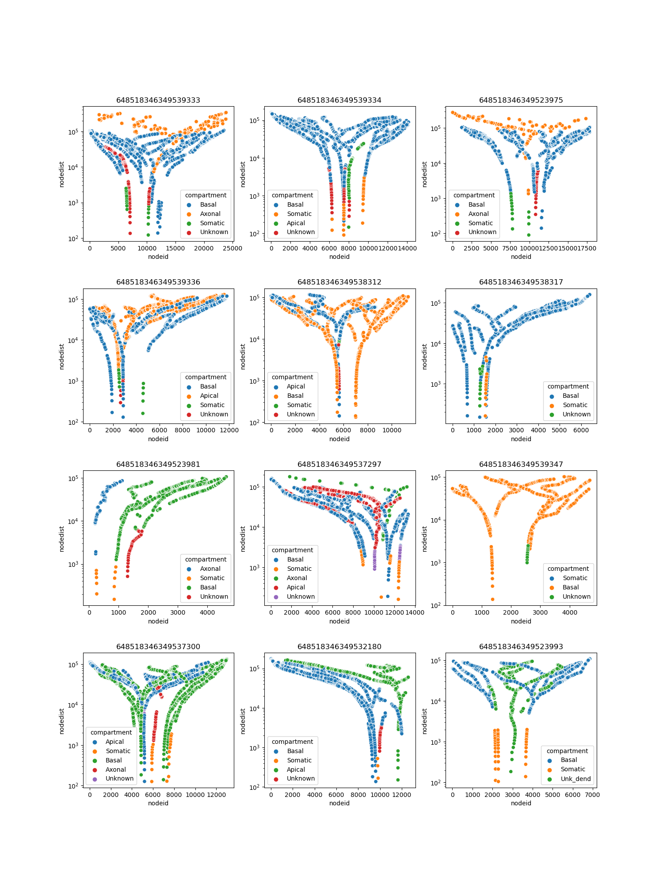

# Mitocondria node metrics
- Analyses from the IARPA [MICrONS consortium](https://www.iarpa.gov/research-programs/microns) mouse cortex Layer 2/3 serial EM volume. 
- The node metrics for the mitochondria segmentation was reported by Turner *et. al.,* Cell 2022. 
- Data derived from [Seung Lab MicronsBinder ](https://github.com/seung-lab/MicronsBinder) and [Allen Institute MicronsBinder](https://github.com/AllenInstitute/MicronsBinder).

---

# Contents

---

## Jupyter Notebook
[`nodeplot_generate_small_mulitples_plots.ipynb`](https://github.com/shandran/layer23-volume/blob/main/mitochondria_analytics/node_metrics/nodeplot_generate_small_mulitples_plots.ipynb)Code to generate a node plot (nodeid vs. nodedist by compartment color) in matplotlib. Code is not optimized for automated generation of nodeplots for all 363 pyramidal neuron. Instead, the code was manually written to create sets of 12 small multiples so the plots can be seen in the notebook. (Note large file size.)

## Nodeplot Renders at 100 dpi
[`nodeplots_100dpi` folder](https://github.com/shandran/layer23-volume/tree/main/mitochondria_analytics/node_metrics/nodeplots_100dpi): renders of nodeplots for all 363 pyramidal neurons in the Layer 2/3 volume in 3x4 small multiples (31 files total).

[`nodeplots.pdf`](https://github.com/shandran/layer23-volume/blob/main/mitochondria_analytics/node_metrics/nodeplots.pdf): View a pdf version of all 363 nodeplots (31 pages total).

---

## Example Nodeplots
Showing a 3x4 small multiple of nodeplots.

---
