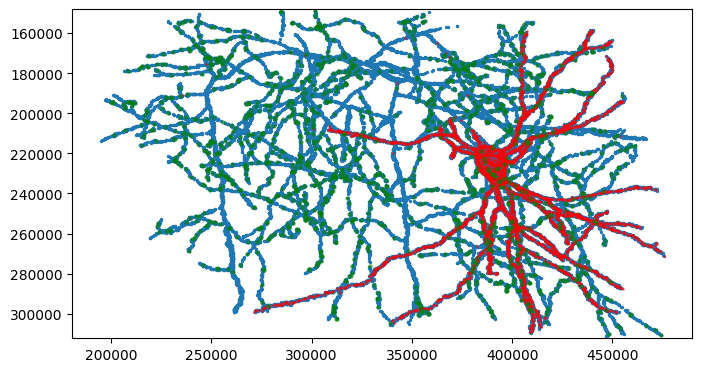
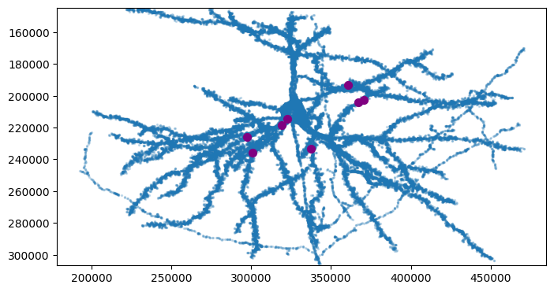
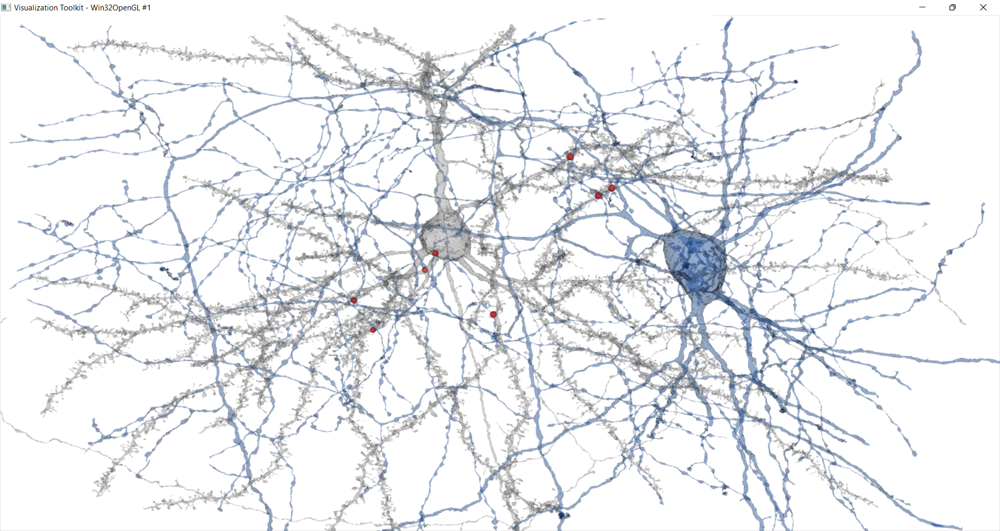

# Two neurons with the most synapses in the Layer 2/3 volume
Visualization and analyses using Neuroglancer and Python tools

***

The `neurons_with_most_synapses_layer23.ipynb` notebook shows how to read and analyze synapses in the Layer 2/3 volume. Note that the synapse table and mesh files are too large for Github; you will need to download those files to your local computer in order to use the notebook.

***

## Summary Presentation
View the summary presentation file: [`neurons_with_the_most_pre_and_post_synapses_in_the_layer23_volume.pdf`](https://github.com/shandran/layer23-volume/blob/main/most_synapses/neurons_with_the_most_pre_and_post_synapses_in_the_layer23_volume.pdf)

## The neuron with the most synapses in the volume
This is an excitatory pyramidal neuron with cell id 648518346349538440  
View the neuron in [neuroglancer](https://neuromancer-seung-import.appspot.com/#!%7B%22layers%22:%5B%7B%22source%22:%22precomputed://gs://microns_public_datasets/pinky100_v0/son_of_alignment_v15_rechunked%22%2C%22type%22:%22image%22%2C%22blend%22:%22default%22%2C%22shaderControls%22:%7B%7D%2C%22name%22:%22EM%22%7D%2C%7B%22source%22:%22precomputed://gs://microns_public_datasets/pinky100_v185/seg%22%2C%22type%22:%22segmentation%22%2C%22selectedAlpha%22:0.51%2C%22segmentColors%22:%7B%22648518346349538440%22:%22#ff33da%22%7D%2C%22segments%22:%5B%22648518346349538440%22%5D%2C%22skeletonRendering%22:%7B%22mode2d%22:%22lines_and_points%22%2C%22mode3d%22:%22lines%22%7D%2C%22name%22:%22cell_segmentation_v185%22%7D%2C%7B%22source%22:%22precomputed://matrix://sseung-archive/pinky100-clefts/mip1_d2_1175k%22%2C%22type%22:%22segmentation%22%2C%22skeletonRendering%22:%7B%22mode2d%22:%22lines_and_points%22%2C%22mode3d%22:%22lines%22%7D%2C%22name%22:%22synapses%22%7D%2C%7B%22source%22:%22precomputed://matrix://sseung-archive/pinky100-mito/seg_191220%22%2C%22type%22:%22segmentation%22%2C%22skeletonRendering%22:%7B%22mode2d%22:%22lines_and_points%22%2C%22mode3d%22:%22lines%22%7D%2C%22name%22:%22mitochondria%22%7D%2C%7B%22source%22:%22precomputed://matrix://sseung-archive/pinky100-nuclei/seg%22%2C%22type%22:%22segmentation%22%2C%22skeletonRendering%22:%7B%22mode2d%22:%22lines_and_points%22%2C%22mode3d%22:%22lines%22%7D%2C%22name%22:%22nuclei%22%7D%5D%2C%22navigation%22:%7B%22pose%22:%7B%22position%22:%7B%22voxelSize%22:%5B4%2C4%2C40%5D%2C%22voxelCoordinates%22:%5B81726.65625%2C55977.7734375%2C1032.9140625%5D%7D%7D%2C%22zoomFactor%22:383.0066650796121%7D%2C%22perspectiveOrientation%22:%5B-0.00825042650103569%2C0.06130112707614899%2C-0.0012821174459531903%2C0.9980843663215637%5D%2C%22perspectiveZoom%22:2016.9180709086706%2C%22showSlices%22:false%2C%22selectedLayer%22:%7B%22layer%22:%22cell_segmentation_v185%22%2C%22visible%22:true%7D%2C%22layout%22:%7B%22type%22:%223d%22%2C%22orthographicProjection%22:true%7D%7D)

## The neuron with the most axonal synapses in the volume

This is an inhibitory basket neuron with cell id 648518346349539215  
View the neuron in [neuroglancer](https://neuromancer-seung-import.appspot.com/#!%7B%22layers%22:%5B%7B%22source%22:%22precomputed://gs://microns_public_datasets/pinky100_v0/son_of_alignment_v15_rechunked%22%2C%22type%22:%22image%22%2C%22blend%22:%22default%22%2C%22shaderControls%22:%7B%7D%2C%22name%22:%22EM%22%7D%2C%7B%22source%22:%22precomputed://gs://microns_public_datasets/pinky100_v185/seg%22%2C%22type%22:%22segmentation%22%2C%22selectedAlpha%22:0.51%2C%22segments%22:%5B%22648518346349539215%22%5D%2C%22skeletonRendering%22:%7B%22mode2d%22:%22lines_and_points%22%2C%22mode3d%22:%22lines%22%7D%2C%22name%22:%22cell_segmentation_v185%22%7D%2C%7B%22source%22:%22precomputed://matrix://sseung-archive/pinky100-clefts/mip1_d2_1175k%22%2C%22type%22:%22segmentation%22%2C%22skeletonRendering%22:%7B%22mode2d%22:%22lines_and_points%22%2C%22mode3d%22:%22lines%22%7D%2C%22name%22:%22synapses%22%7D%2C%7B%22source%22:%22precomputed://matrix://sseung-archive/pinky100-mito/seg_191220%22%2C%22type%22:%22segmentation%22%2C%22skeletonRendering%22:%7B%22mode2d%22:%22lines_and_points%22%2C%22mode3d%22:%22lines%22%7D%2C%22name%22:%22mitochondria%22%7D%2C%7B%22source%22:%22precomputed://matrix://sseung-archive/pinky100-nuclei/seg%22%2C%22type%22:%22segmentation%22%2C%22skeletonRendering%22:%7B%22mode2d%22:%22lines_and_points%22%2C%22mode3d%22:%22lines%22%7D%2C%22name%22:%22nuclei%22%7D%5D%2C%22navigation%22:%7B%22pose%22:%7B%22position%22:%7B%22voxelSize%22:%5B4%2C4%2C40%5D%2C%22voxelCoordinates%22:%5B81505.3359375%2C57426.09765625%2C714.219970703125%5D%7D%7D%2C%22zoomFactor%22:383.0066650796121%7D%2C%22perspectiveOrientation%22:%5B-0.00825042650103569%2C0.06130112707614899%2C-0.0012821174459531903%2C0.9980843663215637%5D%2C%22perspectiveZoom%22:2056.5813672461986%2C%22showSlices%22:false%2C%22selectedLayer%22:%7B%22layer%22:%22cell_segmentation_v185%22%2C%22visible%22:true%7D%2C%22layout%22:%7B%22type%22:%223d%22%2C%22orthographicProjection%22:true%7D%7D)

## Synapse locations on pyramidal neuron 648518346349538440
Afferent synapses (those coming from other neurons either within or outside of the volume) are shown in **red**. Note that these synapses are almost all located on the dendrites and soma (as expected for post-synaptic sites).  
Efferent synapses (where neuron is the pre-synaptic cell and making synapses with other cells in the volume) are shown in **green**. Note that these are all located on the axonal processes (as expected for pre-synaptic sites).

## Synapse locations on basket neuron 648518346349539215
Afferent synapses (post-synaptic) shown in **red** and efferent synapses (pre-synaptic) shown in **green**.  

## The basket neuron makes 8 synaptic contacts on the pyramidal neuron
However, the pyramidal neuron does not make any connections with the basket neuron in the volume (see notebook for details).  

## 3D visualizer using VTK tool
See notebook for details.

