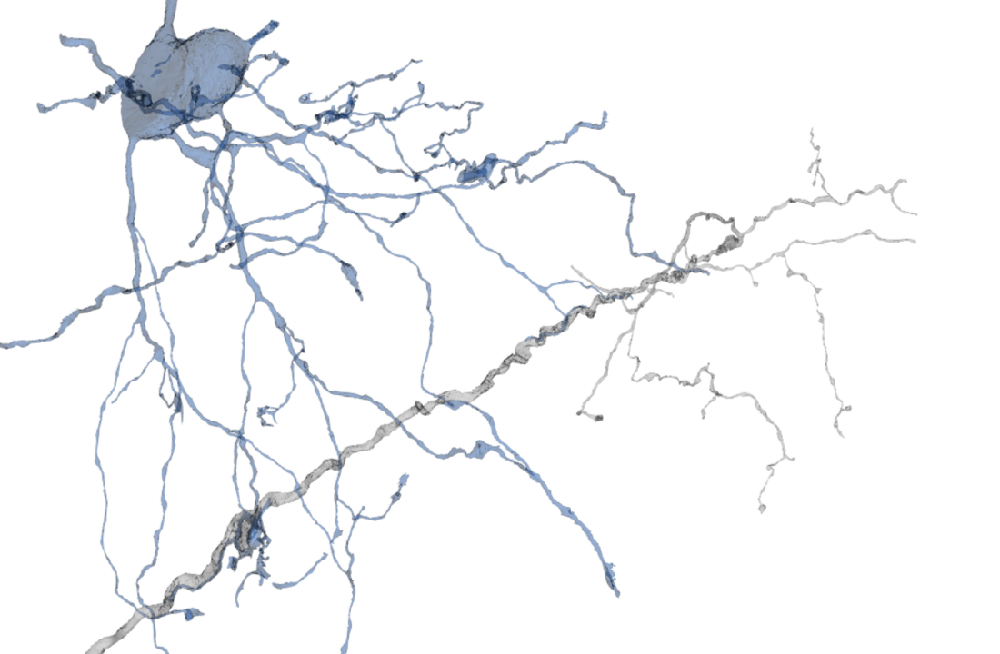

# Oligodendrocyte 648518346349508279
Reconstruction and analysis of an exceptional oligodendrocyte example in the Layer 2/3 volume  

***
## Summary Presentation

View the summary presentation file: [`oligodendrocyte_in layer23_volume.pdf`](https://github.com/shandran/layer23-volume/blob/main/oligodendrocyte_648518346349508279/oligodendrocyte_in%20layer23_volume.pdf)  

***

## Reconstructions

View the oligodendrocyte in [Neuroglancer](https://neuromancer-seung-import.appspot.com/#!%7B%22layers%22:%5B%7B%22source%22:%22precomputed://gs://microns_public_datasets/pinky100_v0/son_of_alignment_v15_rechunked%22%2C%22type%22:%22image%22%2C%22blend%22:%22default%22%2C%22shaderControls%22:%7B%7D%2C%22name%22:%22EM%22%7D%2C%7B%22source%22:%22precomputed://gs://microns_public_datasets/pinky100_v185/seg%22%2C%22type%22:%22segmentation%22%2C%22selectedAlpha%22:0.51%2C%22objectAlpha%22:0.5%2C%22segments%22:%5B%22648518346349508279%22%5D%2C%22hiddenSegments%22:%5B%22648518346349525488%22%5D%2C%22skeletonRendering%22:%7B%22mode2d%22:%22lines_and_points%22%2C%22mode3d%22:%22lines%22%7D%2C%22name%22:%22cell_segmentation_v185%22%7D%2C%7B%22source%22:%22precomputed://matrix://sseung-archive/pinky100-clefts/mip1_d2_1175k%22%2C%22type%22:%22segmentation%22%2C%22skeletonRendering%22:%7B%22mode2d%22:%22lines_and_points%22%2C%22mode3d%22:%22lines%22%7D%2C%22name%22:%22synapses%22%7D%2C%7B%22source%22:%22precomputed://matrix://sseung-archive/pinky100-mito/seg_191220%22%2C%22type%22:%22segmentation%22%2C%22segments%22:%5B%221361093%22%2C%221583375%22%2C%221594053%22%2C%221607506%22%2C%221700322%22%2C%221706264%22%2C%221714962%22%2C%221823836%22%2C%221825313%22%2C%221825575%22%2C%221825750%22%2C%221825758%22%2C%221825802%22%2C%221825831%22%2C%221828119%22%2C%221937721%22%2C%221938011%22%2C%221938021%22%2C%221938023%22%2C%221940625%22%2C%221940882%22%2C%221941148%22%2C%221942164%22%2C%221942300%22%2C%221942622%22%2C%221942670%22%2C%221942671%22%2C%221942735%22%2C%221947721%22%2C%221947858%22%2C%221948740%22%2C%221955806%22%2C%222049313%22%2C%222052592%22%2C%222052604%22%2C%222052605%22%2C%222052608%22%2C%222052637%22%2C%222052644%22%2C%222052716%22%2C%222052739%22%2C%222052803%22%2C%222052815%22%2C%222052844%22%2C%222052892%22%2C%222052935%22%2C%222052940%22%2C%222053029%22%2C%222053158%22%2C%222053193%22%2C%222053219%22%2C%222053236%22%2C%222053339%22%2C%222053477%22%2C%222053489%22%2C%222053496%22%2C%222053551%22%2C%222053554%22%2C%222053600%22%2C%222053642%22%2C%222053650%22%2C%222053725%22%2C%222053767%22%2C%222056349%22%2C%222056352%22%2C%222056410%22%2C%222056421%22%2C%222056437%22%2C%222056463%22%2C%222056519%22%2C%222056599%22%2C%222056653%22%2C%222056665%22%2C%222056705%22%2C%222056720%22%2C%222056740%22%2C%222056747%22%2C%222056759%22%2C%222056768%22%2C%222056797%22%2C%222056863%22%2C%222056885%22%2C%222056956%22%2C%222057094%22%2C%222057100%22%2C%222057103%22%2C%222057142%22%2C%222057155%22%2C%222057196%22%2C%222057198%22%2C%222057214%22%2C%222057265%22%2C%222057311%22%2C%222057357%22%2C%222057361%22%2C%222057432%22%2C%222057472%22%2C%222057485%22%2C%222057508%22%2C%222057517%22%2C%222057527%22%2C%222057533%22%2C%222057543%22%2C%222057555%22%2C%222057576%22%2C%222057584%22%2C%222057585%22%2C%222057592%22%2C%222057599%22%2C%222057602%22%2C%222057619%22%2C%222057628%22%2C%222057630%22%2C%222057632%22%2C%222057634%22%2C%222057679%22%2C%222057724%22%2C%222060614%22%2C%222060626%22%2C%222061136%22%2C%222065942%22%2C%222157181%22%2C%222157182%22%2C%222167275%22%2C%222176628%22%2C%222181098%22%2C%222270461%22%2C%222279986%22%2C%222280420%22%2C%222288375%22%2C%222417806%22%2C%222644857%22%5D%2C%22skeletonRendering%22:%7B%22mode2d%22:%22lines_and_points%22%2C%22mode3d%22:%22lines%22%7D%2C%22name%22:%22mitochondria%22%7D%2C%7B%22source%22:%22precomputed://matrix://sseung-archive/pinky100-nuclei/seg%22%2C%22type%22:%22segmentation%22%2C%22segments%22:%5B%229079%22%5D%2C%22skeletonRendering%22:%7B%22mode2d%22:%22lines_and_points%22%2C%22mode3d%22:%22lines%22%7D%2C%22name%22:%22nuclei%22%7D%5D%2C%22navigation%22:%7B%22pose%22:%7B%22position%22:%7B%22voxelSize%22:%5B4%2C4%2C40%5D%2C%22voxelCoordinates%22:%5B78172.7109375%2C61857.734375%2C2065.51123046875%5D%7D%7D%2C%22zoomFactor%22:383.0066650796121%7D%2C%22perspectiveOrientation%22:%5B0.07668248564004898%2C-0.031148964539170265%2C-0.024943655356764793%2C0.9962566494941711%5D%2C%22perspectiveZoom%22:934.6516052652976%2C%22showSlices%22:false%2C%22selectedLayer%22:%7B%22layer%22:%22cell_segmentation_v185%22%2C%22visible%22:true%7D%2C%22layout%22:%7B%22type%22:%223d%22%2C%22orthographicProjection%22:true%7D%7D)    
*All mitochondria segments were added using the* `lookup_mitochondria_ids.ipynb` [*notebook.*](https://github.com/shandran/layer23-volume/blob/main/lookup_mitochondria_ids.ipynb) *The nucleus segment was added manually in Neuroglancer.*

  

A view of a dendritic process (neurite cellid 648518346349468729) that is myelinated by this oligodendrocyte, in [Neuroglancer](https://neuromancer-seung-import.appspot.com/#!%7B%22layers%22:%5B%7B%22source%22:%22precomputed://gs://microns_public_datasets/pinky100_v0/son_of_alignment_v15_rechunked%22%2C%22type%22:%22image%22%2C%22blend%22:%22default%22%2C%22shaderControls%22:%7B%7D%2C%22name%22:%22EM%22%7D%2C%7B%22source%22:%22precomputed://gs://microns_public_datasets/pinky100_v185/seg%22%2C%22type%22:%22segmentation%22%2C%22selectedAlpha%22:0.51%2C%22objectAlpha%22:0.24%2C%22segments%22:%5B%22648518346349468729%22%2C%22648518346349508279%22%5D%2C%22hiddenSegments%22:%5B%22648518346341353466%22%2C%22648518346341374188%22%2C%22648518346341396099%22%2C%22648518346341407281%22%2C%22648518346342064915%22%2C%22648518346342074489%22%2C%22648518346342362743%22%2C%22648518346342790442%22%2C%22648518346342797282%22%2C%22648518346342802169%22%2C%22648518346342804984%22%2C%22648518346342923242%22%2C%22648518346343069501%22%2C%22648518346343238751%22%2C%22648518346343238764%22%2C%22648518346343239516%22%2C%22648518346343239525%22%2C%22648518346343943213%22%2C%22648518346346081751%22%2C%22648518346346298538%22%2C%22648518346346301241%22%2C%22648518346346383261%22%2C%22648518346346390430%22%2C%22648518346346695754%22%2C%22648518346346695764%22%2C%22648518346346996001%22%2C%22648518346347064317%22%2C%22648518346349509733%22%2C%22648518346349510085%22%2C%22648518346349512877%22%2C%22648518346349513971%22%2C%22648518346349514298%22%2C%22648518346349514509%22%2C%22648518346349514545%22%2C%22648518346349515038%22%2C%22648518346349525488%22%2C%22648518346349539096%22%5D%2C%22skeletonRendering%22:%7B%22mode2d%22:%22lines_and_points%22%2C%22mode3d%22:%22lines%22%7D%2C%22name%22:%22cell_segmentation_v185%22%7D%2C%7B%22source%22:%22precomputed://matrix://sseung-archive/pinky100-clefts/mip1_d2_1175k%22%2C%22type%22:%22segmentation%22%2C%22segments%22:%5B%220%22%5D%2C%22skeletonRendering%22:%7B%22mode2d%22:%22lines_and_points%22%2C%22mode3d%22:%22lines%22%7D%2C%22name%22:%22synapses%22%7D%2C%7B%22source%22:%22precomputed://matrix://sseung-archive/pinky100-mito/seg_191220%22%2C%22type%22:%22segmentation%22%2C%22segments%22:%5B%221361093%22%2C%221583375%22%2C%221594053%22%2C%221607506%22%2C%221700322%22%2C%221706264%22%2C%221714962%22%2C%221823836%22%2C%221825313%22%2C%221825575%22%2C%221825750%22%2C%221825758%22%2C%221825802%22%2C%221825831%22%2C%221828119%22%2C%221937721%22%2C%221938011%22%2C%221938021%22%2C%221938023%22%2C%221940625%22%2C%221940882%22%2C%221941148%22%2C%221942164%22%2C%221942300%22%2C%221942622%22%2C%221942670%22%2C%221942671%22%2C%221942735%22%2C%221947721%22%2C%221947858%22%2C%221948740%22%2C%221955806%22%2C%222049313%22%2C%222052592%22%2C%222052604%22%2C%222052605%22%2C%222052608%22%2C%222052637%22%2C%222052644%22%2C%222052716%22%2C%222052739%22%2C%222052803%22%2C%222052815%22%2C%222052844%22%2C%222052892%22%2C%222052935%22%2C%222052940%22%2C%222053029%22%2C%222053158%22%2C%222053193%22%2C%222053219%22%2C%222053236%22%2C%222053339%22%2C%222053477%22%2C%222053489%22%2C%222053496%22%2C%222053551%22%2C%222053554%22%2C%222053600%22%2C%222053642%22%2C%222053650%22%2C%222053725%22%2C%222053767%22%2C%222056349%22%2C%222056352%22%2C%222056410%22%2C%222056421%22%2C%222056437%22%2C%222056463%22%2C%222056519%22%2C%222056599%22%2C%222056653%22%2C%222056665%22%2C%222056705%22%2C%222056720%22%2C%222056740%22%2C%222056747%22%2C%222056759%22%2C%222056768%22%2C%222056797%22%2C%222056863%22%2C%222056885%22%2C%222056956%22%2C%222057094%22%2C%222057100%22%2C%222057103%22%2C%222057142%22%2C%222057155%22%2C%222057196%22%2C%222057198%22%2C%222057214%22%2C%222057265%22%2C%222057311%22%2C%222057357%22%2C%222057361%22%2C%222057432%22%2C%222057472%22%2C%222057485%22%2C%222057508%22%2C%222057517%22%2C%222057527%22%2C%222057533%22%2C%222057543%22%2C%222057555%22%2C%222057576%22%2C%222057584%22%2C%222057585%22%2C%222057592%22%2C%222057599%22%2C%222057602%22%2C%222057619%22%2C%222057628%22%2C%222057630%22%2C%222057632%22%2C%222057634%22%2C%222057679%22%2C%222057724%22%2C%222060614%22%2C%222060626%22%2C%222061136%22%2C%222065942%22%2C%222157181%22%2C%222157182%22%2C%222167275%22%2C%222176628%22%2C%222181098%22%2C%222270461%22%2C%222279986%22%2C%222280420%22%2C%222288375%22%2C%222417806%22%2C%222422328%22%2C%222644857%22%5D%2C%22skeletonRendering%22:%7B%22mode2d%22:%22lines_and_points%22%2C%22mode3d%22:%22lines%22%7D%2C%22name%22:%22mitochondria%22%7D%2C%7B%22source%22:%22precomputed://matrix://sseung-archive/pinky100-nuclei/seg%22%2C%22type%22:%22segmentation%22%2C%22segments%22:%5B%229079%22%5D%2C%22skeletonRendering%22:%7B%22mode2d%22:%22lines_and_points%22%2C%22mode3d%22:%22lines%22%7D%2C%22name%22:%22nuclei%22%7D%5D%2C%22navigation%22:%7B%22pose%22:%7B%22position%22:%7B%22voxelSize%22:%5B4%2C4%2C40%5D%2C%22voxelCoordinates%22:%5B83844.8671875%2C56821.8359375%2C1314.4759521484375%5D%7D%7D%2C%22zoomFactor%22:5.984479141868939%7D%2C%22perspectiveOrientation%22:%5B0.025919552892446518%2C-0.12779192626476288%2C0.3591802716255188%2C-0.9241141080856323%5D%2C%22perspectiveZoom%22:464.0817091035666%2C%22showSlices%22:false%2C%22selectedLayer%22:%7B%22layer%22:%22cell_segmentation_v185%22%7D%2C%22layout%22:%7B%22type%22:%22xy-3d%22%2C%22orthographicProjection%22:true%7D%7D)

  

A 3D rendering of the same region using the OpenGL vtk tool.  

  

## Mis-segmented synaptic bouton
A synaptic bouton with a compound synapse was assigned to the oligodendrocyte cell. Looking at the raw electromicrographs in Neuroglancer, you can see that a nearby axon is continuous with the synaptic bouton, but the segmentation algorithm made an error. The Microns Consortium estimates an approximate 10% segmentation error, so errors such as these are not uncommon.  

  

