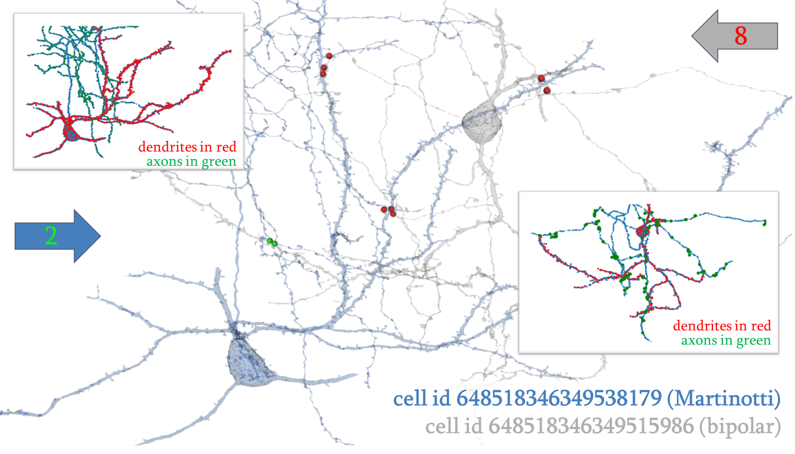
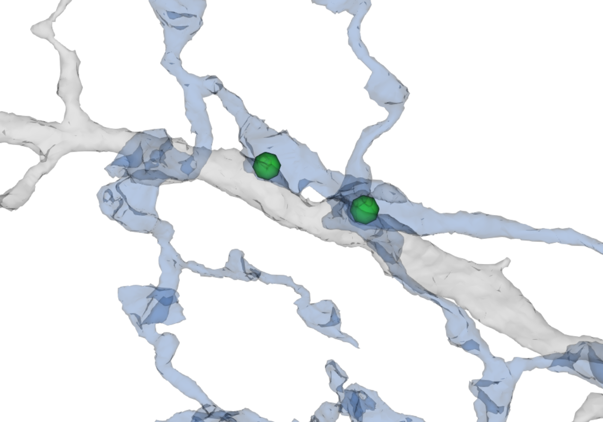
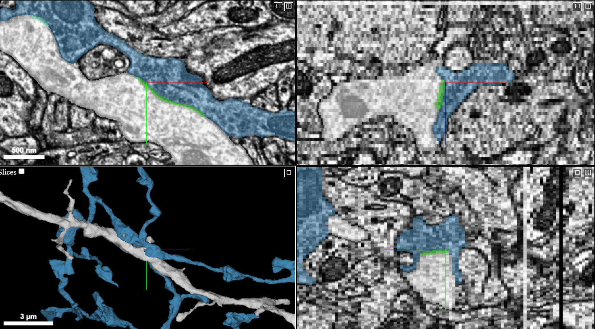
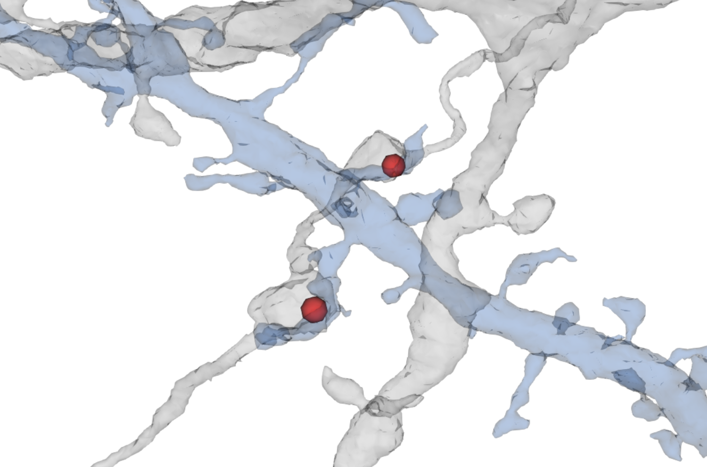
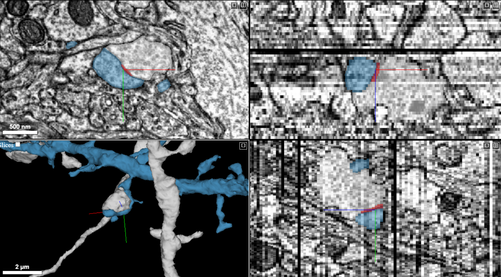

# Reciprocal Pairs
Analysis of pairs of neurons (or partial neurons) that synapse onto one another

***

***

# Summary Presentation

### View the [Reciprocal Pairs](https://github.com/shandran/layer23-volume/blob/main/reciprocal_pairs/reciprocal_pairs_summary_presentation.pdf) summary presentation.

***

# Contents

## Notebooks and datatables

Use the [`list_of_all_reciprocal_pairs.ipynb` notebook]() to list and analyze all the reciprocal synapses in the volume. A special thank you to [Wanwen Zeng](https://github.com/wanwenzeng) at Stanford for generating the dictionary code to generate the reciprocal synapse list.  

Use the [`reciprocal_pairs_neurons_with_soma_in_volume.ipynb` notebook]() to list and analyze all the reciprocal pairs of neurons that have an identified soma within the Layer 2/3 volume.  

Use the [`reciprocal_pairs_synapse_visualizer.ipynb` notebook]() to generate 2D and 3D visualizations (using matplotlib, meshparty and vtk) of synapses for a desired set of reciprocal pairs. Includes over a dozen example pairs.  

The [`paired.csv` datatable](https://github.com/shandran/layer23-volume/blob/main/reciprocal_pairs/paired.csv) contains all the reciprocal pairs (n = 1998/2 = 999) in the entire volume, including all the partial processes as well.  

The [`pairs_rm_v_g_na.csv` datatable](https://github.com/shandran/layer23-volume/blob/main/reciprocal_pairs/pairs_rm_v_g_na.csv) contains the reciprocal pairs where both pairs have an identified soma in the volume, filtering out vascular and glial cells (because these are mis-segmented synapses anyway!), as well as filtering out the partial proceses. This was generated using the [`220309_cell_type_classification.csv` datatable](https://github.com/shandran/layer23-volume/blob/main/data/220309_cell_type_classification.csv). *Confession: due to my novice pandas skills, I found it more expedient to create the datatable in Excel using a simple vlookup function.*

***

## Visualization examples

### Martinotti-bipolar reciprocal pair

***

#### View the pair in [neuroglancer](https://neuromancer-seung-import.appspot.com/#!%7B%22layers%22:%5B%7B%22source%22:%22precomputed://gs://microns_public_datasets/pinky100_v0/son_of_alignment_v15_rechunked%22%2C%22type%22:%22image%22%2C%22blend%22:%22default%22%2C%22shaderControls%22:%7B%7D%2C%22name%22:%22EM%22%7D%2C%7B%22source%22:%22precomputed://gs://microns_public_datasets/pinky100_v185/seg%22%2C%22type%22:%22segmentation%22%2C%22selectedAlpha%22:0.51%2C%22segmentColors%22:%7B%22648518346349538179%22:%22#4790bd%22%2C%22648518346349515986%22:%22#b0b0b0%22%7D%2C%22segments%22:%5B%22648518346349515986%22%2C%22648518346349538179%22%5D%2C%22skeletonRendering%22:%7B%22mode2d%22:%22lines_and_points%22%2C%22mode3d%22:%22lines%22%7D%2C%22name%22:%22cell_segmentation_v185%22%7D%2C%7B%22source%22:%22precomputed://matrix://sseung-archive/pinky100-clefts/mip1_d2_1175k%22%2C%22type%22:%22segmentation%22%2C%22segmentColors%22:%7B%221820509%22:%22#88f7c3%22%2C%221821379%22:%22#3fd920%22%2C%223787202%22:%22#e11414%22%7D%2C%22segments%22:%5B%221820509%22%2C%221821379%22%2C%223787202%22%5D%2C%22skeletonRendering%22:%7B%22mode2d%22:%22lines_and_points%22%2C%22mode3d%22:%22lines%22%7D%2C%22name%22:%22synapses%22%7D%2C%7B%22source%22:%22precomputed://matrix://sseung-archive/pinky100-mito/seg_191220%22%2C%22type%22:%22segmentation%22%2C%22skeletonRendering%22:%7B%22mode2d%22:%22lines_and_points%22%2C%22mode3d%22:%22lines%22%7D%2C%22name%22:%22mitochondria%22%2C%22visible%22:false%7D%2C%7B%22source%22:%22precomputed://matrix://sseung-archive/pinky100-nuclei/seg%22%2C%22type%22:%22segmentation%22%2C%22skeletonRendering%22:%7B%22mode2d%22:%22lines_and_points%22%2C%22mode3d%22:%22lines%22%7D%2C%22name%22:%22nuclei%22%7D%5D%2C%22navigation%22:%7B%22pose%22:%7B%22position%22:%7B%22voxelSize%22:%5B4%2C4%2C40%5D%2C%22voxelCoordinates%22:%5B78146.0859375%2C55412.35546875%2C203.04591369628906%5D%7D%7D%2C%22zoomFactor%22:5.984479141868939%7D%2C%22showAxisLines%22:false%2C%22perspectiveZoom%22:1847.633855593252%2C%22showSlices%22:false%2C%22selectedLayer%22:%7B%22layer%22:%22synapses%22%2C%22visible%22:true%7D%2C%22layout%22:%7B%22type%22:%223d%22%2C%22orthographicProjection%22:true%7D%7D).

***

The inhibitory Martinotti neuron makes two synapses onto another inhibitory bipolar neuron. In turn, the bipolar neuron makes eight synapses onto the Martinotti neuron. Closeup 3D views (using meshparty and vtk) and the original electron micrograph views (in Neuroglancer) of select synapses are shown as well.  

#### 3D view of Martinotti neuron synapses on a bipolar neuron

#### Neuroglancer EM view of these two synapses

#### 3D view of one of the bipolar neuron's synapse onto a Martinotti neuron

#### Neuroglancer EM view of this synapse

